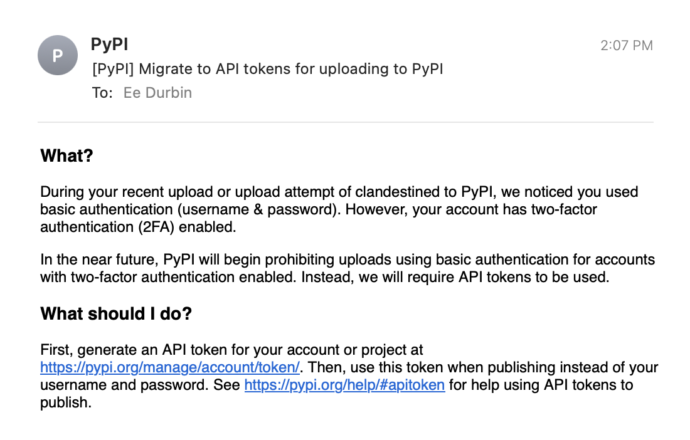

Beginning today, all uploads from user accounts with 2FA enabled
will be required to use an [API Token](https://pypi.org/help/#apitoken)
or [Trusted Publisher](https://docs.pypi.org/trusted-publishers/) configuration
in place of their password.

<!-- more -->

This change has [been planned](https://github.com/pypi/warehouse/issues/7265)
since 2FA was rolled out in 2019.
In [February of 2022](https://github.com/pypi/warehouse/pull/10836)
we began notifying users on upload that this change was coming.

If you have 2FA enabled and have been using only your password to upload,
the following email is likely familiar to you:

<figure markdown>
  
  <figcaption>
      A sample notice email sent when users with 2FA enabled
      upload using only their password.
  </figcaption>
</figure>

Initially, we intended for this notice to live for six months before
we began enforcement.

However, some valid concerns were raised regarding
the use of user-scoped API tokens for new project creation.

With the [introduction of Trusted Publishers](./2023-04-20-introducing-trusted-publishers.md)
PyPI now provides a way for users to publish **new** projects without
provisioning a user-scoped token, and to continue publishing without
ever provisioning a long lived API token whatsoever.

Given this, and our [commitment to further rolling out 2FA across PyPI](./2023-05-25-securing-pypi-with-2fa.md),
we are now enforcing this policy.

---

_Ee Durbin is the Director of Infrastructure at
the Python Software Foundation.
They have been contributing to keeping PyPI online, available, and
secure since 2013._
