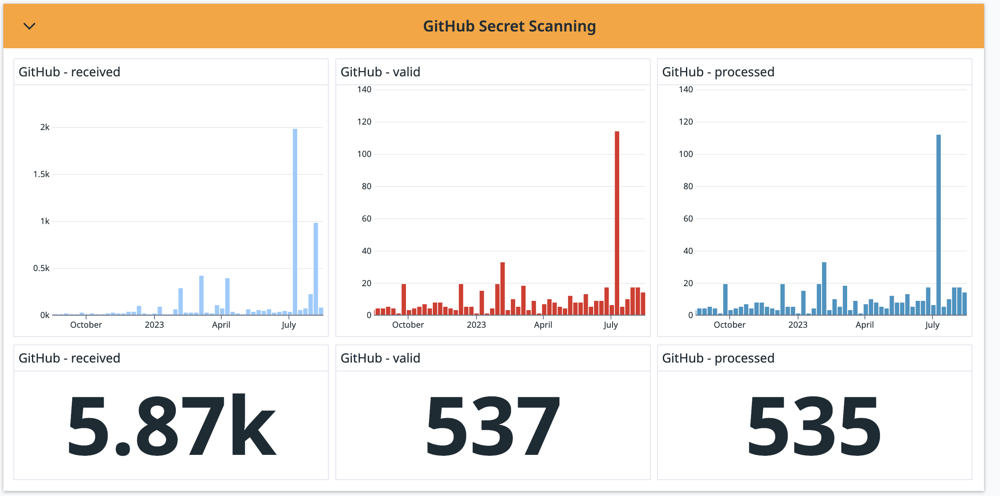

Back in 2019 we [kicked off efforts](https://github.com/pypi/warehouse/issues/6051)
to integrate with GitHub secret scanning.
Due to the complexity in nature, the completed integration launched in 2021,
with the volunteer-led effort by Joachim Jablon ([@ewjoachim](https://github.com/ewjoachim))
and the GitHub team.

<!-- more -->

PyPI didn't have a blog back then, but GitHub did!
Here's [a link their post](https://github.blog/changelog/2021-03-22-the-python-package-index-is-now-a-github-secret-scanning-integrator/).

The completed integration increased security for all PyPI users.
If a user accidentally made their PyPI token public by committing it
and pushing it to a GitHub public repository,
GitHub would notify us and we would automatically revoke the token to prevent any misuse.
This process often completes within seconds.

**Cool, Mike, that was two years ago, so what?**

GitHub [announced yesterday](https://github.blog/changelog/2023-08-16-secret-scanning-detects-secrets-in-issues-for-free-public-repositories/) that they will now notify users about any secrets exposed in:

> ... issue's title, description, or comments, including historical revisions ...

This is a great enhancement to their existing secret scanning capabilities,
previously only scanning **code**.

And even better, we don't have to change anything,
as we continue to receive the same notifications from our existing integration with GitHub. 🎉

When implementing the integration,
we set up some metrics to track the number of tokens revoked.
Here's a visualization showing the amount of inbound notifications from GitHub,
and the number of tokens we've revoked *(click for larger image)*:

<figure markdown>
  
  <figcaption>Bar charts of values over period of 1 year, and total counts of: received (5.87k), valid (537), processed (535)</figcaption>
</figure>

We show 15 months of data,
thanks to our infrastructure sponsor [Datadog](https://www.datadoghq.com/).

The large discrepancy between "received" and "valid" can be due to
GitHub reporting the same token multiple times.
This can happen if the token is used in multiple repositories, forks, etc.

The small discrepancy between "valid" and "processed" is due to that
we may raise an exception when attempting to email the owner of a token that has been revoked, after which we don't mark it as "processed" when exception is raised.
The second time the task runs, the token is now invalid, and doesn't increment the "valid" count.

Read [GitHub's notice on The Changelog](https://github.blog/changelog/2023-08-16-secret-scanning-detects-secrets-in-issues-for-free-public-repositories/)
for more details.

If your organization performs this kind of secret scanning,
we'd love to hear from you and integrate with your tooling.
