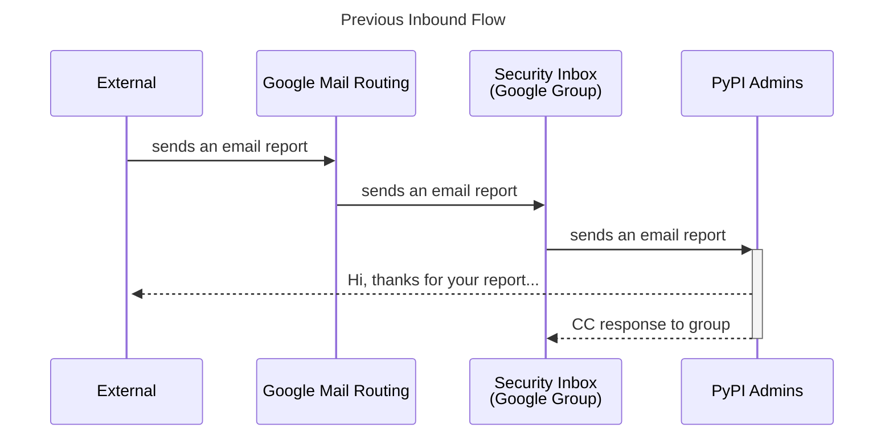
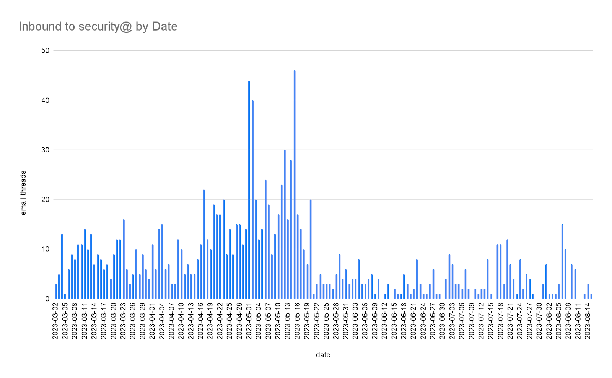
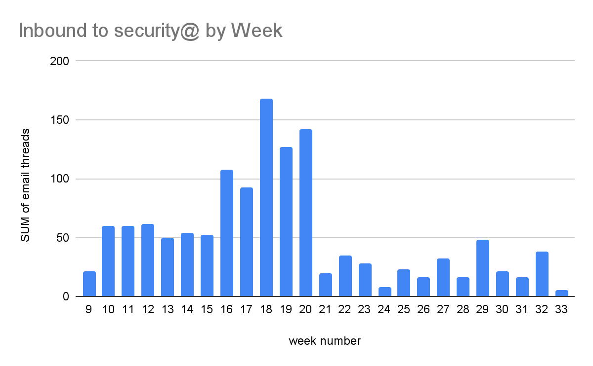
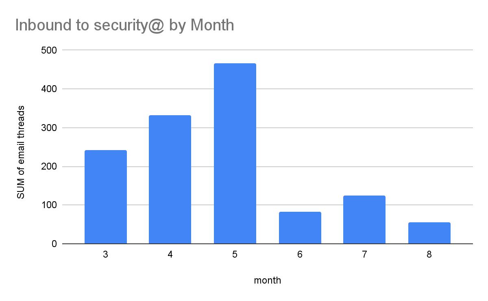
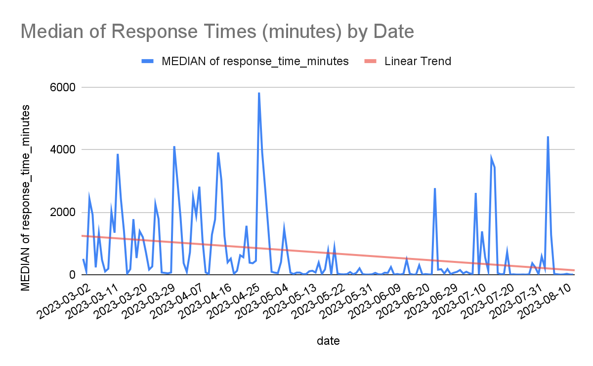
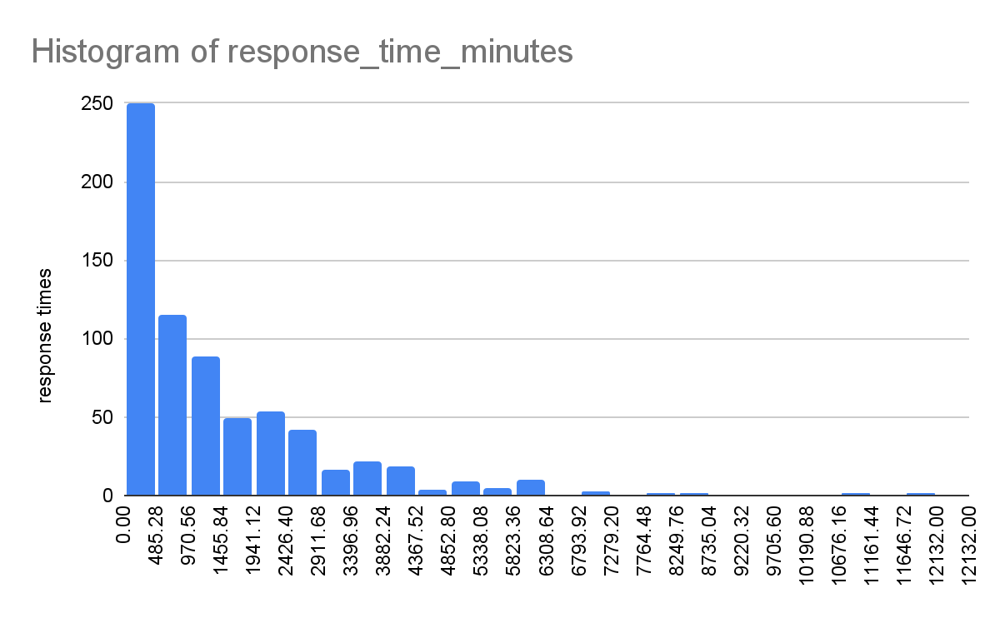
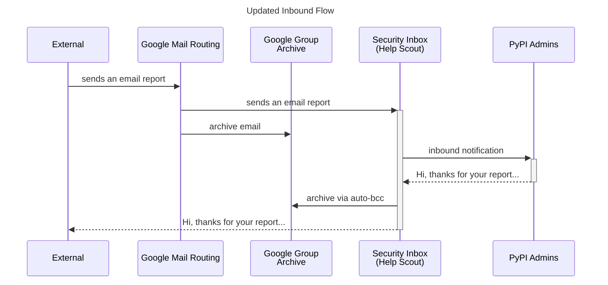

## Background

The current [PyPI security reporting procedure](https://pypi.org/security/)
directs reporters to send an email to <security@pypi.org> with details.
`security@` was previously an email alias for `admin@`,
a Google Group that contains all current PyPI Administrators (4 people).

<!-- more -->

I'll refer to the `security@` address as the **Security Inbox** herein,
despite it not being a traditional inbox, and what changes we've made to it.

The inbound reporting workflow was roughly:

- Admins receive an email to the Security Inbox
- Any admin reads the email
- Admin inspects the indicators of compromise (IOC), package and user history.
  Often using [inspector.pypi.io](https://inspector.pypi.io/) to investigate package contents
- Admin takes an action (oftentimes to remove as malware)
- Admin responds to reporter and CCs the Security Inbox for tracking

Here's a rough sequence diagram demonstrating the notification flow:

I wanted to answer a couple of questions, so as to have some data to work with:

1. How many inbound malware reports do we receive? (daily/weekly/monthly)
1. How long does it take for a response from an administrator to remove the reported malware?

Answering these questions with the email-based system will not be 100% accurate,
as there are some conditions that lead to inaccuracies,
but since we're looking at large volumes of records,
it's unlikely that the inaccuracies will lead to material differences in the numbers.
Some examples:

- A reporter submits multiple reports on a single message
- A reporter replies to their original email for a new report,
  instead of starting a new thread/conversation
- Folks contacting admins for support may email the Security Inbox
- Security-related issues that are not malware reports
- Spam

This was largely to establish a baseline of where we are today.
With this measurement, we can then observe whether changes to our process
have a positive or negative impact on the volume and response times.

_Note_: This analysis is not an accurate measurement of distinct malware packages reported,
as multiple researchers may report the same package,
which will show up as distinct conversation threads.
We could try to normalize the packages, however since the emails are unstructured,
that may take more effort than is worthwhile.
In any case, admins respond to duplicates, so there's still non-zero effort being done.

Earlier this year one of our admins posted some removals stats on Twitter (before we had a blog!):

<blockquote class="twitter-tweet">
in 2022, the <a href="https://twitter.com/pypi?ref_src=twsrc%5Etfw">@pypi</a> team removed &gt;12,000 unique projects. each were instances of spam, typosquatting, dependency confusion, exfiltration and/or malware.  2022: ~12K (mostly malware) 2021: ~27K (mostly dep confusion) 2020: ~500 2019: 65 2018: 137 2017: 38
&mdash; Dustin Ingram (@di_codes) <a href="https://twitter.com/di_codes/status/1610781657128108033?ref_src=twsrc%5Etfw">January 4, 2023</a></blockquote> 

## What is the frequency of inbound malware reports?

To determine this answer, I elected to use the emails themselves,
since that's the feed we have of details.
While this is an imperfect data source, it should be good enough to make some early assertions.
We can also leverage any statistics generated thus far to assist in measuring future progress.

My PyPI Google Workspace account was created on 2023-03-02 and began receiving <security@pypi.org> emails after that.
Google Groups does not surface any APIs I could find
that allows an authenticated user to list/read conversations directly from the group.

This approach provides a cleaner signal-to-noise ratio,
as I often delete the random emails that are sent to the Security Inbox if they are not useful
(spam, marketing, etc).
We can either accept this approach of data collection for the past few months,
or pursue other methods for collecting longer-term data from older accounts/mailing lists,
all subject to different data quality issues.

Using the data based on 1,303 email threads sent to the Security Inbox
by 2023-08-14, we can produce this chart:

The same data, grouped by week number:

One observation is that post-[PyPI Weekend Suspension](https://status.python.org/incidents/qy2t9mjjcc7g)
in May (Week 20), the overall volume drops for a while.
There's no hard evidence as to why, but it's interesting
that a brief disruption reduced some of the toil maintainers currently handle.

Form completeness, here's the monthly view:

---

## How long does it take to respond?

Why is response time interesting?
The longer a malicious package is available for end users to install,
the more people and systems it may affect.
This is further complicated to any package mirrors that capture the malware,
and may not remove it as quickly as PyPI admins.
We have received anecdotal evidence from reporters that PyPI admins are
already quite fast at handling inbound reports (`#humblebrag`),
but let's see if we can get data out of the same emails.

Again, since the nature of email isn't 100% accurate in this case,
we'll rely on calculating the duration of time (in minutes)
between the first message of a thread and the last message of a thread.
This doesn't account for the occasional behavior of a reporter
reusing the same thread to report more packages,
nor does it reflect any other back-and-forth communication
between admins and reporters.
As such, removing any threads that have more than 4 total messages
helps remove outliers from the analysis.

Inbound reports come in at any time of day,
and can also be automatically generated by reporters.
It's common for reports to wait to be handled while we’re asleep.
Weekends and holidays often have longer response times as well.

On occasion an inbound report may get overlooked,
something we're trying to solve with a new system, more on this later.

A higher response time may indicate that the mostly-volunteer admins
missed responding to it the first time around.
For the purpose of this analysis, I've excluded 7 total response times
that exceed 14 days (20,160 minutes) to remove those outliers.

Using median values over averages
helps us account for outliers at either end of the spectrum.

Applying a linear trend line to the collected data shows
that response times are generally decreasing over time, which is a good thing.

Here's a distribution of response times for the data collected since March 2023:

This chart informs us that most responses to reports are completed
in under ~485 minutes (~8 hours),
and almost all are done within a few days of the report, with a long tail.

All said, that doesn't capture the full picture of response times,
which is why we've been working on a new system to help us respond faster,
and produce better reports.

## What's changed as a result?

Part of the PyPI Malware Reporting and Response project is
to explore ways to decrease the response times even further,
while reducing the toil on maintainers, and increasing visibility to reporters.

As a result of this analysis, one change we've made so far is to leverage
a shared inbox system [Help Scout](https://www.helpscout.com/)
to receive inbound emails and allow us to tag, assign, and close out reports.
This helps is by not missing reports, and preventing duplicate responses from admins.

Here's how we updated our Google Workspace flow so we can continue
to receive inbound emails, as well as copy the conversations from Help Scout
for long-term archival into Google Groups.

There's no change to end users, and we hope our change keeps us on track
to continue to respond to reports in a timely fashion.

Here's an initial look at the response times since we started using Help Scout,
(2023-09-05) using their reporting.
With a total of 31 conversations in the time period since we started using Help Scout,
and comparing to the final two weeks of data from the previous chart (59 conversations),
we can see that the response times have improved:

| Response time bucket | % of total | pre-Help Scout |
| --- | --- | --- |
| < 15 min | 40% | 53% |
| 15-30 min | 20% | 10% |
| 30-60 min | 20% | 5% |
| 1-2 hours | 10% | 7% |
| 2-12 hours | 10% | 15% |
| 12+ hours | 0% | 10% |

We can now happily report that 80% all reports are responded to
**within 60 minutes of receipt**,
with 100% are responded to within 12 hours.

We will continue to monitor our response times and volumes,
and make adjustments as needed.

## What's next?

We're working on designing a new system to help us respond faster,
based in inbound reports, and provide better outcomes.
It's still very early, and we're incorporating a lot of ideas in the design
based on collective experience of PyPI admins, external researchers and reporters.

We invite you to engage in the conversation on a more machine-readable
format for reporting malware in
[this GitHub Issue](https://github.com/pypi/warehouse/issues/14503),
and consider sending pull requests where appropriate.
