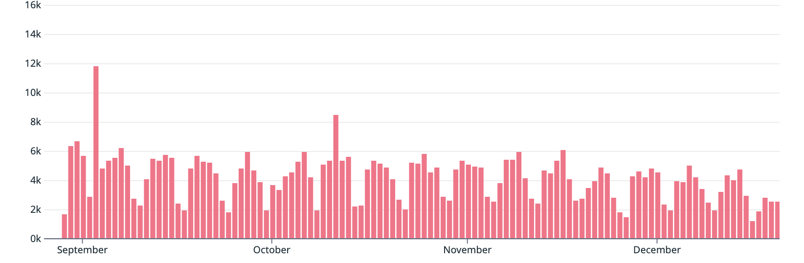

## Two-factor Authentication is required for all users

It's January 1st, 2024, and PyPI now requires [Two-factor authentication (2FA)](https://pypi.org/help/#twofa) for **all users**.

This post is a recognition of the hard work that went into making this a reality,
and a thank you to all the users who have enabled 2FA on their accounts.

It is also a reminder to those who have not yet enabled 2FA,
that you will need to do so before you can perform any management actions,
or upload files to PyPI.

Once 2FA is enabled, you may perform management actions,
including generating [API Tokens](https://pypi.org/help/#apitoken)
or setting up [Trusted Publishers](https://pypi.org/help/#trusted-publishers) (preferred)
to upload files.

<!-- more -->

## Why didn't I hear about this?

We take backwards compatibility very seriously,
and try our best to preserve behaviours
our wide community of users have come to expect.

We've been talking about this for a while,
and have worked to make it easy to enable a form of 2FA - TOTP or WebAuthn (or both!).
We've also tried to be very vocal about the upcoming change.

In July 2022, PyPI secured sponsorship for a [giveaway of 4,000 hardware keys](https://pypi.org/security-key-giveaway/)
for eligible maintainers of the top 1% of projects by downloads
to enable 2FA on their PyPI accounts.
Thanks, Google Open Source Security Team!

We wrote posts on the PyPI Blog (this!) to announce the change,
and some of them were picked up by other technology news sites.

Here's some of the posts:

- [Securing PyPI accounts via Two-Factor Authentication](2023-05-25-securing-pypi-with-2fa.md)
- [2FA Enforcement for upload.pypi.org](2023-06-01-2fa-enforcement-for-upload.md)
- [2FA Enforcement for New User Registrations](2023-08-08-2fa-enforcement-for-new-users.md)
- [2FA Enforcement for TestPyPI](2023-12-06-2fa-enforcement-on-testpypi.md)
- [2FA Requirement for PyPI begins 2024-01-01](2023-12-13-2fa-enforcement.md)

We followed most posts with links on social media posts, other blogs, and news aggregators.

Mike Fiedler, the [PyPI Safety & Security Engineer](2023-08-04-pypi-hires-safety-engineer.md)
(and author of this post!) spoke with some Python podcasts to further get the word out.
Listen to [RealPython](https://realpython.com/podcasts/rpp/177/) and [Talk Python](https://talkpython.fm/episodes/show/435/pypi-security) episodes.

In August 2023, we [developed an email campaign](https://github.com/pypi/warehouse/pull/14444)
to notify users post-upload to PyPI, who had not yet enabled 2FA on their accounts.

<figure markdown>
  
  <figcaption>We have sent over 474,000 emails to date.</figcaption>
</figure>

## How did we get here?

_(Apologies if there's inaccuracies, feel free to send a pull request with any corrections!)_

In 2019, the PSF received a grant from the Open Technology Fund to improve the security of PyPI.

Here's some posts from the era that predates the PyPI Blog:

- [Commencing Security, Accessibility, and Internationalization Improvements to PyPI for 2019](https://pyfound.blogspot.com/2019/03/commencing-security-accessibility-and.html)
- [Use two-factor auth to improve your PyPI account's security](https://blog.python.org/2019/05/use-two-factor-auth-to-improve-your.html)
- [PyPI Now Supports Two-Factor Login via WebAuthn](https://pyfound.blogspot.com/2019/06/pypi-now-supports-two-factor-login-via.html)
- [PyPI now supports uploading via API token](https://pyfound.blogspot.com/2019/07/pypi-now-supports-uploading-via-api.html)
- [Start using 2FA and API tokens on PyPI](https://pyfound.blogspot.com/2020/01/start-using-2fa-and-api-tokens-on-pypi.html)

You might also enjoy this blog from [Trail of Bits](https://www.trailofbits.com/),
our implementation partner:
[Getting 2FA Right in 2019](https://blog.trailofbits.com/2019/06/20/getting-2fa-right-in-2019/)

## What's next?

We'll be continuing to improve the security of PyPI,
and we're always looking for help.

If you're interested in helping out,
please check out the [PyPI issue tracker](https://github.com/pypi/warehouse/issues),
and the PSF Packaging Working Group's [fundables](https://github.com/psf/fundable-packaging-improvements).

## Thank you!

Thank you to all the users who have enabled 2FA on their accounts,
you are helping to make PyPI more secure for everyone.

Thank you to all the contributors to PyPI,
and the maintainers of the projects that make up PyPI.
Your work is appreciated. ❤️

*[TOTP]: Time-based one-time password
*[WebAuthn]: Web Authentication
