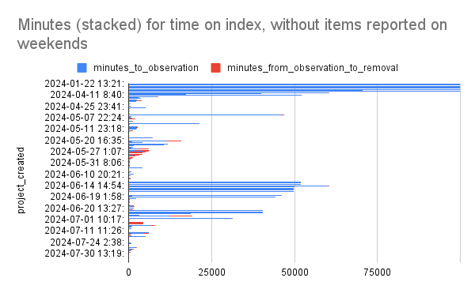
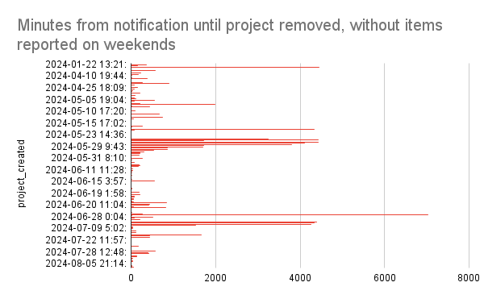

Hello reader! It's me, Mike, and it's been just over a year since I posted
[about joining the PSF](2023-08-04-pypi-hires-safety-engineer.md)
as the Safety & Security Engineer for the Python Package Index (PyPI).

I wanted to take a moment to reflect on the past year,
and share some of the things I've been working on.

<!-- more -->

You may recall when a the [role was announced](2023-05-09-announcing-pypi-safety-and-security-engr-role.md),
and shortly thereafter a [malware reporting project was announced](2023-06-22-malware-detection-project.md),
both made viable by generous funding from external donors,
namely Amazon Web Services (AWS) and
the Center for Security and Emerging Technology (CSET),
without whom none of this would have been possible.
Please thank them however you can.

Some grouped highlights of the past year:

## Two Factor Authentication (2FA) for All

In the final few months of 2023, I took on the task of bringing the progress of
[two factor authentication (2FA)](2023-05-25-securing-pypi-with-2fa.md)
to **all** PyPI user accounts that started back in 2019.
A monumental task, as there are about 850,000 accounts in the system.

Some related blogs here:

- [2FA Enforcement for New User Registrations](2023-08-08-2fa-enforcement-for-new-users.md)
- [2FA Enforcement for TestPyPI](2023-12-06-2fa-enforcement-on-testpypi.md)
- [2FA Requirement for PyPI begins 2024-01-01](2023-12-13-2fa-enforcement.md)
- [2FA Required for PyPI](2024-01-01-2fa-enforced.md)

And a couple of 2FA-related incident reports that highlighted the need for 2FA:

- [User Account Takeover](2023-12-04-account-takeover.md)
- [Unauthorized User Accounts Access](2024-04-03-user-account-access.md)

After the second incident, PyPI Admins decided to invalidate all user account
email addresses that had not completed 2FA setup,
as a way to minimize Account Takeover attacks.

This was a multi-step process, and I'm happy to report that as of today,
over **140,000 users** have one or more forms of 2FA.
As of today, ~80% of all users that have logged in since January 2024
have 2FA enabled.
The remainder have yet to complete the 2FA enrollment process,
and cannot perform any actions on PyPI.
The number of users with 2FA will continue to grow over time,
and older user accounts returning to publish an update to a project
must enroll in 2FA as part of the process.

Now that 2FA is required for all publishers to PyPI,
the risk of malicious code being delivered through an account takeover
has been drastically reduced and our entire community is safer.
Thank you to everyone who enrolled in 2FA during the rollout.

## PyPI's First Audit

Also in late 2023, the Open Technology Fund (OTF) funded an audit of PyPI,
the first in its history.
Read the [first part of the three-part blog series](2023-11-14-1-pypi-completes-first-security-audit.md)
to learn more about the audit and its findings.
I hope you enjoy the series!

In preparation for the audit, I created [system architecture diagrams
for the PyPI infrastructure](https://warehouse.pypa.io/architecture.html),
which were used as part of the audit to help inform auditors on where to focus.
During the audit, I met with the auditors weekly to learn about any findings,
and work to prioritize and resolve them.

After the audit concluded, I worked with the auditors on their final report,
as well as our blog series to share with the community.

## Malware Response and Reporting

If you read this blog regularly,
you may notice that there's been a focus on malware response, and that's true.
As malware is a constant threat to the Python ecosystem,
I've been working on a number of projects to better respond to malware.
Here's some highlights:

### Inbound Notifications

Initially, the only method for contacting PyPI Admins was via email.
We have since replaced direct email with a shared inbox system,
minimizing overlapping response or even missed response.
We gained the ability to automate responses with workflows, tag with metadata,
and collect reports.

I tried to capture the state of the processes in this blog:
[Inbound Malware Volume Report](2023-09-18-inbound-malware-reporting.md)

I then developed Observations within the PyPI code itself.
An enhancement to the existing data models by adding the ability to attach
semi-arbitrary notes or annotations to other models in PyPI's database,
such as project, release, or a file.
For example, an Observation can be submitted either via the web interface
from any logged-in user, or via a secured beta API for trusted reporters.
The API work required implementing a more fine-grained permissions model,
which reduces the scope of specific actions
and makes permissions clearer in the code.

The web form and API-based approaches create more structure around the reports,
leading to faster investigation and resolution times for the "easy" malware cases,
and provides more time to investigate the "harder" cases.

A deeper dive on this can be read here:
[Malware Reporting Evolved](2024-03-06-malware-reporting-evolved.md)

Since August 2023, the inbound notification process has received
~2,000 inbound messages.
The new Observation and reporting process was implemented in February 2024,
and ~1,400 inbound notifications have come through this approach
(Two larger malware campaigns in March and June of ~500 reports each).

Since March 2024, we preserve the reports past the project’s removal.
Previously when we removed the malicious project, we would also remove
the associated Observations.
Now we preserve these reports for posterity and analysis.

We have seen 76 distinct reporters,
of which 3 have submitted over 200 distinct reports,
5 reporters are in the double-digits,
and the remaining long tail of smaller volume reports.

The breakdown of the inbound reports per reporting channels since March 2024 are:

| origin | count |
|--------|-------|
| Web button | 498 |
| Beta API | 403 |
| Admin UI | 6 |

Thanks to all the folks who report malware to PyPI,
and even more that have stepped up to experiment with the beta reporting API!

### Admin Response

As reports come in, it is the responsibility of a PyPI Admin
to determine the validity of a given report and take action accordingly.

Building on the existing PyPI Admin user interface,
I created views and quick response buttons to enable faster evaluation
and taking action, while minimizing mistakes or manual/one-off actions.

Since August 2023, over 90% of all issues were resolved in under 24 hours,
with under one minute of handle time for over 95% of those issues.
For ~900 projects removed since mid-March 2024,
we have generated ~1,300 distinct reports based on the inbound notifications
for qualified malware reports.
These reports are available as a private beta for interested parties.

Post: [PyPI Malware Observation Report Outcomes - Private Preview](https://discuss.python.org/t/pypi-malware-observation-report-outcomes-private-preview/49060)

Using some of the collected Observation data from January 2024 onwards,
excluding nights and weekends, as we do not yet have a 24/7 response team,
we can see the following trends:

The above chart displays a 2024 view of a stacked time (in minutes)
for each inbound report that led to a project removal.
The blue bars indicate the time taken from the project's creation
until it was reported to PyPI.
The red bars indicate how long it took for PyPI Admins to respond
and remove the project.

We can observe a trend of decreasing time of malware being live on PyPI,
from months-and-days to hours-and-minutes.

To show the response timings more clearly, let's only look at the time between
report received and project removed:

The 6,000 minute outlier was over July 4th holiday weekend.

Hopefully this trend continues to improve as we refine our processes and tooling.

### Project Lifecycle Status - Quarantine

Beyond the traditional response of removing projects from PyPI,
I have introduced another action for a given project's lifecycle - "quarantine".
This state allows PyPI Admins to place a project in a non-destructive quarantine
for further analysis, removing the ability for end-users to easily install
the project until it's been further investigated.

Having this intermediary stage enables PyPI Admins to
create more safety for end users,
protecting end users quicker by PyPI Admins removing a suspicious package
from being installed, while allowing further investigation.
Since project removal from PyPI is a destructive action,
creating a quarantine state allows for restoring a project
if deemed a false positive report without destroying
any of the project's history or metadata.

I don't have a blog for this yet, but may author one soon.

## CISA Response

In early August 2023, the Cybersecurity and Infrastructure Security Agency (CISA)
[announced a Request For Information (RFI) on Open-Source Software Security](https://www.cisa.gov/news-events/news/we-want-your-input-help-secure-open-source-software).
The actual [RFI text can be read here](https://www.regulations.gov/document/ONCD-2023-0002-0001).

In November 2023, the PSF [submitted a response](https://www.regulations.gov/comment/ONCD-2023-0002-0107)
to CISA's RFI.

I had never written anything to the Federal Government before,
so this was a new experience for me.
Many of us at the PSF collaborated on the response,
I drove the PyPI-focused and packaging security-focused sections in the document.

This was a great opportunity to highlight PyPI's importance in the Python ecosystem,
including its criticality for virtually all organizations.

## Et cetera

While working on all that stuff above, I did a lot of other things too.
Some examples:

- incorporating an OpenAPI-based approach for the new API endpoints
- refactoring core data models for extensibility
- refactoring permissions models for finer-grain control over user actions
- catching more bots during registration with a new captcha service

While working in the `warehouse` codebase all day,
I've made a variety of improvements to the development environment,
testing speed, and code quality, mostly to help myself,
with the added benefit of making it easier for others to contribute.

As well as "routine" work - handling inbound reports, analysis, and response.

I also attended some conferences, round tables, and meetings, including
Fastly Altitude 2023, AWS re:Invent 2023, PyCon US 2024, and AWS re:Inforce 2024,
amongst some.
I've also been getting more involved with the
[OpenSSF](https://openssf.org/)
[Securing Software Repositories Working Group](https://github.com/ossf/wg-securing-software-repos).

There's literally no way I could cover everything here,
but hopefully this has given you a good overview of what I've been up to.
I'm so excited for the next year's work, stay tuned for more!
