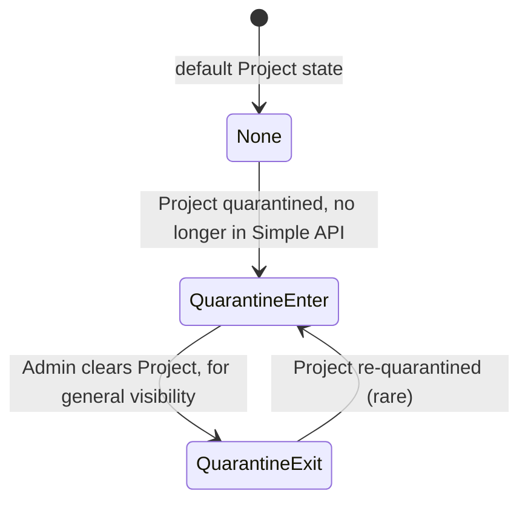
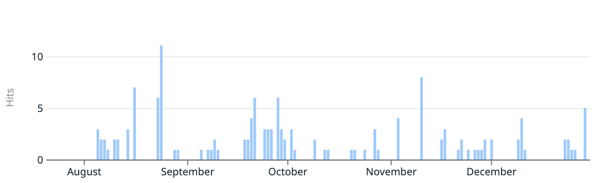

Earlier this year, I wrote briefly about new functionality added to PyPI, the
[ability to quarantine projects](./2024-08-16-safety-and-security-engineer-year-in-review.md#project-lifecycle-status-quarantine).
This feature allows PyPI administrators to mark a project as potentially harmful,
and prevent it from being easily installed by users to prevent further harm.

In this post I'll discuss the implementation, and further improvements to come.

<!-- more -->

## Background

Malware on PyPI is a persistent problem.

PyPI has concepts of Projects, Releases, and Files[^1].
These are all discrete data models[^2],
and behave slightly differently based on their characteristics.
A Project may have 0 or more Releases, a Release may have 1 or more Files.

Researchers will often report a given Project as malware,
and will link to a specific location in a File for a given Release,
per the [PyPI Security process](https://pypi.org/security/).

PyPI will receive malware reports[^3] that are often relevant to an entire Project.
Simply put: a Project, along with all of its Releases (usually 1)
and Files (usually 1-2) are all part of a similar campaign,
and should be removed from PyPI to protect end users.
This is not universally true, as malware has been added to established,
mature Projects via a new Release after some sort of account access takeover,
so there may be a need to consider reporting malware for a given Release/File -
something not yet fully implemented via Observations
or the [beta Malware API](./2024-03-06-malware-reporting-evolved.md#via-api).

When reviewing and acting on malware reports,
PyPI Admins had one main tool at their disposal:
**complete removal of the Project from the PyPI database**.
This is often coupled with prohibiting the Project name from being reused.
PyPI has functionality irrespective of malware to prevent File name reuse.

The impact of these removals can be disruptive,
and removals are pretty much irrevocable -
it's the same mechanism PyPI warns project owners about
when they elect to remove their project from the index[^4].

Further, the longer a malicious Project remains publicly available,
the greater the potential for end users to install
and become victims of said malware.
With the current full-time security staff for PyPI == 1,
there is potential for malware to remain installable by users for longer periods of time,
and asking volunteer PyPI Admins for extra hours of work is not sustainable.

Reducing the time window when a malicious Project/Release/File is available
for end users to become victims is an improvement,
and further reduces the incentive for malicious actors
to use PyPI as their distribution method.

## Implementation

The implementation of Project Quarantine shape as I learned more about the
possible states a project could be in.
I jotted down some basic requirements for the feature:

- Project exists on PyPI that has Releases and Files
- Project is not installable (hidden from simple index) while in quarantine
- Project is not modifiable by the project owner while in quarantine
- Project state is visible to Project Owners, security researchers, and PyPI Administrators
- Project state can be reverted by a PyPI Administrator to restore general visibility
- Project can be removed/deleted by a PyPI Administrator

With those in mind, I set out to implement the feature.

### Take a page from the book of Yank

Prior to this change, an existing feature was "Yank",
per [PEP 592](https://peps.python.org/pep-0592/). 

A Project with no Releases will be listed in the Simple Repository API[^5],
but the resulting detail page will not have any links,
making it effectively uninstallable[^6].
One idea was when quarantining a Project,
we could mark it as having no Releases,
and thus excluding it from the index.

The difference from "yank" is that a yanked Release is still installable by clients,
and quarantined items should not be installable -
so we'd have to explore where to make the change and how that would impact clients.
Yank is also applied to a Release (and all of its Files), not a Project.
We could apply a change to every Release for a Project, instead of Project-wide,
and thus set ourselves up for quarantining individual Releases.

This ends up more complex, trying to account for a rare edge case
where a mature Project has a new Release that needs to be quarantined,
and would prevent disruption of existing users of prior Releases.

We accept that this might happen, and track very closely if and when it does,
and defer implementation until that time.

### Create an Observer-only visibility API

I had previously built a new beta API infrastructure
to allow Observers to report malicious Projects.
One idea was to add a new authenticated API endpoint
to allow querying the current list of quarantined Projects,
and supply links to their Releases and Files for consumption.

Thus, a researcher could download the artifacts in question,
but not via `pip install ...`

I ended up not pursuing this approach,
as the beta authenticated APIs are still being developed,
and I didn't want to add more functionality before we swing back
and figure out some critical authentication and authorization issues
needed for the future of management API endpoints.

### Lifecycle Status

The exploration to remove items from the Simple Repository API paid off,
and pointed me in the direction that turned into `LifecycleStatus`,
which is a new status applied to a Project.

A state diagram to illustrate the flow of the Project through the states:

Adding `LifecycleStatus` state to the Project model helps
other functions in the code make a single-point decisions,
and allows for a more complex state machine to be implemented in the future.
Potential states could include "Archived", "Deprecated", and others.

### Admin Interface

Since the point of the implementation is to allow PyPI Admins to manage the state,
and oftentimes during nights, weekends, and holidays, and from a phone web browser,
I wanted to make the interface as simple as possible.

When developing the Admin interface, I recorded a video to share with the team,
so they could see the changes in action and provide feedback.

<figure>
  
  <figcaption>
    <a href="https://www.loom.com/share/a472c06ab76542fca1ecaaef2a419f3d">
      
Admin Interface for Quarantine 👩‍💻 - Watch Video

    </a>
    

      Note: Some of the UIs in the video may have changed since the recording,
      almost all data is mocked.
    

  </figcaption>
</figure>

As we use the admin interface more, we'll likely find areas to improve,
and iterate to make the process more efficient.

## Usage

Since August, the Quarantine feature has been in use,
with PyPI Admins marking ~140 reported projects as Quarantined.

Of these, **only a single project** has exited Quarantine, others have been removed.

The one project cleared was a project containing obfuscated code,
in violation of the PyPI
[Acceptable Use Policy](https://policies.python.org/pypi.org/Acceptable-Use-Policy/).
The project owner corrected the violation after being contacted by PyPI Admins.
I've created some outreach templates to help with this process,
and have reached out to 20+ project owners to inform them of their violation,
and to provide guidance on how to correct it.

## Future Improvement - Automation

The next step in the Quarantine feature is to add the ability to
automatically place a Project in Quarantine when "enough credible reports" are received.
That's in quotes because we're still working on defining what "enough" and "credible" mean -
and how to automate the process without causing undue harm to legitimate projects.

To date, we've onboarded a number of security researchers,
internally known as "Observers" to use a beta API endpoint to submit malware reports.
We also allow any authenticated PyPI user to submit a malware report
via a web form on a Project's page (technically a Release... but that's a different story).
To prevent abuse of the quarantine system, we could place a minimum requirement
of Observers reporting a given Project,
as well as only consider a single non-Observer report in the calculation.

For example, these combinations of reports for a Project would result in a quarantined project:

- 2+ Observer reports
- 1 Observer + 1 non-Observer report

This is only one idea so far - we could explore other combinations as they surface.

The idea behind Auto-Quarantine is to support the concept of
receiving multiple reports **for the same Project** during nights and weekends,
and reduce the Project's time alive on PyPI,
while preserving the ability to revert the state in a non-destructive manner
in the event of a false-positive.

This will likely also pair with the need to add a "notify admins" feature.
Probably a webhook to our Slack channel, so we can be notified in real-time
when a Project is quarantined, and can take action as needed, as well
as adding more visibility to quarantined projects in the Admin interface.

There's plenty of chewy bits to work on,
and I'm excited to see how `LifecycleStatus` evolves,
and share more about it in the future.

<!-- footnotes -->

[^1]: See <https://pypi.org/help/#packages> for more
[^2]: See <https://github.com/pypi/warehouse/blob/main/warehouse/packaging/models.py> for more
[^3]: Referred to internally as `Observations(kind="is_malware")`
[^4]:
  Yes, it's true, some of the database objects can be reconstructed,
  but it is time-consuming and tricky, used only in severe catastrophe situations.
[^5]: See [Simple repository API - Python Packaging User Guide](https://packaging.python.org/en/latest/specifications/simple-repository-api/) for more
[^6]:
  Roughly 3% of Projects in the simple index have 0 releases.
  Excluding these would save ~1 MB of the ~29 MB main index HTML response.
