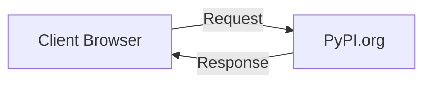
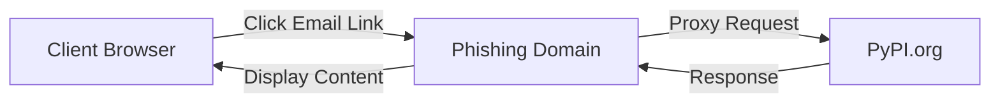

# Incident Report: Phishing Attack

Over the past few days, a phishing attack targeting PyPI users via email was uncovered.
Our [initial report](2025-07-28-pypi-phishing-attack.md) was posted to raise awareness of the attack,
and to provide some initial details on the attack vector.

Social media posts linking to the initial report have been shared widely,
PyPI itself has not been breached with this attack.

## Summary

* 4 user accounts were successfully phished, now either disabled or credentials rotated
* 2 API Tokens were generated by the attackers, which have since been revoked
* 2 releases of the `num2words` project were uploaded by the attacker, which have since been removed
* The phishing domain has been taken down

<!-- more -->

This appears to be similar in nature to a recent incident involving `npm` packages, 
where attackers successfully phished end-user credentials, 
and then compromised popular packages to distribute malware via npmjs.com.
Read a [report on this attack here](https://www.bleepingcomputer.com/news/security/popular-npm-linter-packages-hijacked-via-phishing-to-drop-malware/).

To briefly recap the attack pattern,
the attackers established a domain name, SSL certificate, 
and server running in a Virtual Private Server (VPS) in the cloud, 
which would transparently proxy requests to PyPI.org.
This could be termed a "forward proxy", many CDN providers operate their services this way.
We cannot know for certain, but it appears that the attackers sent emails 
to addresses found in package metadata, which is publicly available due to
users putting them in their `setup.py` or `pyproject.toml` files.
The emails contained links to the phishing domain,
asking them to verify their email address.
When users clicked the link, they were directed to the phishing domain,
which presented the PyPI.org website,
but with a different URL in the browser address bar.

Normal traffic flow:

Phishing attack flow:

This may be termed ["adversary in the middle" (AiTM) attack](https://capec.mitre.org/data/definitions/94.html),
however the difference here is that the attacker is not intercepting traffic between the user and PyPI.org,
rather is acting as a forward proxy, 
which is a common practice for content delivery networks (CDNs) and the like.

Since a browser's address bar showed `hxxps://pypj.org/...`,
and the website content of legitimate `pypi.org`,
users might have missed the small difference between a lowercase `i` and `j`, 
and tricked into thinking they were on the official PyPI website,
and submitted their credentials to the phishing domain.

The phisher could then capture the credentials,
and use them to log in to the real PyPI.org website,
potentially compromising the user's account and any packages they maintain.

Having a form of two-factor authentication (2FA) enabled on the account
generally prevents phishing attacks like this from being successful,
as the attacker would need access to the second factor (e.g. a TOTP code)
to complete the login process.

However, since the attacker was in between the user and PyPI.org,
they could have captured the second factor as well, and could have used the TOTP code
within a short time interval, or potentially even captured the session cookies
provided during the response to the login request, 
and thus bypassed the need for 2FA for a short time.

If the user had enrolled a [Security Device](https://pypi.org/help/#utfkey)
for PyPI second factor authentication, the attacker would not have been able to use the second factor,
as the WebAuthn protocol requires the user to physically interact with a hardware security key,
or use a browser-based implementation, which would not be possible
if the user was not on the legitimate PyPI.org website ([Relying Party Identifier](https://www.w3.org/TR/webauthn-2/#relying-party)).

Also, there are a significant amount of relatively inactive users who pre-date 2FA on PyPI,
and may not have 2FA enabled on their accounts.
If a user in this category fell for the phishing attack,
they would still need to complete email address verification, and 2FA enrollment.
This process generates an email from PyPI to the user,
which links back to the legitimate PyPI.org address.
These user accounts were not as vulnerable to this specific attack.

## Timeline of events
Times are in both Eastern Daylight Time (EDT) and UTC.
Some events may be omitted for brevity.

_Keep in mind: in the USA, the weekend is Saturday and Sunday._

### 2025-07-26 Saturday
- 13:14 EDT (17:14 UTC): A user emails PyPI Security about a suspicious phishing email they received,
  which appears to be from PyPI.org, but with a different domain name.
- 14:01 EDT (18:01 UTC): A volunteer PyPI Admin posts a message about this phishing attack in the PyPI Admins chat.
- 18:37 EDT (22:37 UTC): A community member posts about their experience on [Python Forums](https://discuss.python.org/t/pypi-org-phishing-attack/100267)
- 19:18 EDT (23:18 UTC): On-call PyPI Admin sees the message and escalates to another volunteer PyPI Admin for assistance, 
  while submitting abuse complaints to the domain registrar NameSilo (report #1) and content delivery network (CDN) provider Cloudflare (report #2).
- 19:38 EDT (23:38 UTC): A volunteer PyPI Admin responds, and begins investigation of the phishing attack.
- 20:07 EDT (00:07 UTC): The volunteer PyPI Admin shares findings and some actions taken in chat, and has to leave for personal reasons.

### 2025-07-27 Sunday
- 06:34 EDT (10:34 UTC): On-call PyPI Admin updates that the registrar has indicated they should submit a different form, which they do.
  They also confirm that the [PSF Trademarks Working Group](https://www.python.org/psf/trademarks/) are also working on this from a trademark perspective to notify the CDN and registrar of the abuse.

### 2025-07-28 Monday
- 08:57 EDT (12:57 UTC): PyPI Admin staff sees the comments in chat, begins investigation follow up
- 09:20 EDT (13:20 UTC): Available PyPI Admins (volunteer and staff) & other PSF parties meet to determine next steps.
- 10:22 EDT (14:22 UTC): PyPI Admins post an [initial report](2025-07-28-pypi-phishing-attack.md) to the PyPI blog, and share it on social media.
- 10:44 EDT (14:44 UTC): PyPI Admins post a notice to [`pypi-announce` mailing list](https://mail.python.org/mailman3/lists/pypi-announce.python.org/), 
  and a similar is posted to the more general [`security-announce` mailing list](https://mail.python.org/mailman3/lists/security-announce.python.org/).
- 11:37 EDT (15:37 UTC): A [new feature is added to PyPI](https://github.com/pypi/warehouse/pull/18427) to detect and warn users about phishing domains,
  which is deployed to production.
- 11:59 EDT (15:59 UTC): A threat hunter posts on Twitter about a finding in `num2words` 0.5.15
- 12:01 EDT (16:01 UTC): Another PyPI Admin submits another abuse report to Cloudflare (report #3), with more context and details - requests, headers, IP address, and more.
- 12:05 EDT (16:05 UTC): Cloudflare response to initial abuse complaint from Saturday (report #2) as "invalid".
- 12:18 EDT (16:18 UTC): PyPI Admins observe that Cloudflare placed a "Suspected Phishing" warning when visiting the phishing domain, 
  reducing the probability for users to fall for the attack, despite declining the abuse reports.
- 12:20 EDT (16:20 UTC): NameSilo places the phishing domain under administrative `ClientHold` status.
- 12:23 EDT (16:23 UTC): Cloudflare responds to second abuse report (report #3) as "invalid".
- 12:38 EDT (16:38 UTC): `num2words` project owner responds on Twitter confirming removal of 0.5.15
- 12:54 EDT (16:54 UTC): `num2words` project owner responds on Twitter confirming removal of 0.5.16 as well as suspicious API Token

After the domain registrar NameSilo placed the domain name under `clientHold` status,
new DNS resolutions failed, as there are no name servers.
Host records for a client to resolve the domain name to an IP address will then fail.
As DNS caches expired, users no longer were able to resolve the domain name,
and thus unable to access the phishing site.

Incident is considered resolved, PyPI Admins continue to monitor the situation,
and analysis of the attack continues.

## Impact Analysis

The phishing attack was targeted at PyPI users,
and since we were able to obtain at least one confirmed IP address of the hosting server,
we have found 4 such successful phishing attacks, and have taken action on them.

A single account appears to have further activity beyond credentials being compromised,
and the attacker uploaded releases to PyPI.org via a newly-provisioned API Token.
`num2words` versions 0.5.15 and 0.5.16 were uploaded to PyPI.org,
which included malware, and removed within hours of being uploaded by the owner of the account.

The impacted user [posted about the activity on Twitter](https://nitter.tiekoetter.com/SFLinux/status/1949906299308953827):

> Thanks for the heads up! There was a phishing attack on pypi this morning.  The compromised version of num2words v 0.5.15 have been removed.

and later:

> I found a weird token in our pypi account, probably the attacker had created it. I removed the token and deleted the malicious version again (0.5.16). I also created new backup TOTP codes for MFA. Will keep an eye on it but hopefully they won't be able to reupload the malware.

An advisory has been published [PYSEC-2025-72](https://osv.dev/vulnerability/PYSEC-2025-72)
to help end user and tooling to detect the malicious versions.

## Takeaways

### Anti-impersonation Email Prevention

PyPI has settings for [Sender Policy Framework (SPF)](https://postmarkapp.com/glossary/sender-policy-framework),
[DomainKeys Identified Mail (DKIM)](https://dkim.org/),
and [Domain-based Message Authentication, Reporting & Conformance (DMARC)](https://dmarc.org/)
to help prevent phishing attacks by verifying the authenticity of emails sent from PyPI.org.

However, each mail server that receives an email from PyPI.org is responsible for checking these values,
and taking action based on the results of those checks.
If the receiving mail server does not check these headers, or does not take action based on the
results, then the email may still be delivered to the user's inbox.
In this case, it appears that the phishing email was delivered to some users' inboxes,
despite the presence of these headers.

In other cases, the receiving mail server may have checked the headers,
and presented the user with a "Looks like Spam" warning,
leaving it up to the user to decide whether to trust the email or not.
This is a common practice, as many email providers do not block emails outright,
but instead mark them as spam or suspicious, allowing users to make the final decision.

Ultimately, it is up to the user to be vigilant and cautious when clicking links in emails,
especially when the email is unexpected or from an unknown sender.

### Abuse Reporting & Responses

We were surprised that our reports to Cloudflare were rejected due to them being unable to confirm phishing,
which lead to a longer-than-expected period of the phishing domain being online.
We don't have additional visibility into why these reports were initially considered invalid
by Cloudflare or why they did eventually result in a takedown,
but we will review and determine if future reports could be made more actionable.

### Alternate spelling domain names

The PSF is exploring the transfer of domain names used in this attack
and other similar domains to have them registered to the PSF,
and prevent future abuse.
This effort has significant costs associated with it, so the outcome is not guaranteed.

If successful, this would allow the PSF to take control of the domain names,
and possibly redirect them to either a warning page,
or to the official PyPI.org website,
preventing future phishing attacks using these domain names.

## Call to action

Some things you can do to help prevent this kind of attack in the future:

* If you have a dormant PyPI account, consider removing it if you do not need it.
  This will help reduce the number of potential targets for attackers.
* If you have an older PyPI account, and have not logged in since 2FA has been required,
  consider logging in and enabling 2FA on your account.
  This will help protect your account from future phishing attacks.
* Use WebAuthn via browser or hardware security keys for 2FA on your PyPI account.
  This will help protect your account from phishing attacks,
  as the attacker would need access to the second factor to complete the login process.

Security is a never-ending process, and we are always looking for ways to improve our security posture.
If you have specific ideas or suggestions for improving PyPI security,
and are willing to help implement them, consider checking our [Issue Tracker](https://github.com/pypi/warehouse/issues)
or if you have something more sensitive, you can email [security@pypi.org](mailto:security@pypi.org).

This work would not be possible without generous donations,
please consider [supporting the PSF](https://www.python.org/psf/)
to ensure this kind of work can continue to serve the worldwide Python community.

## Indicators of Compromise

Analysis exposed some indicators of compromise (IoCs) that may be useful for detecting this attack,
and similar attacks in the future.

- Domain name: `pypj.org`
- IP address: `45.9.148.108` - the phishing email sending server
- IP address: `45.9.148.85` - the phishing domain hosting server
- Domain name: `modirosa.com` - used by attackers to establish accounts on PyPI.org
- Domain name: `necub.com` - used by attackers to establish accounts on PyPI.org
- PyPI Package: `num2words` - versions 0.5.15 and 0.5.16

### Related CAPECs
- [CAPEC-94](https://capec.mitre.org/data/definitions/94.html) - Adversary in the Middle (AiTM) Attack
- [CAPEC-98](https://capec.mitre.org/data/definitions/98.html) - Phishing
