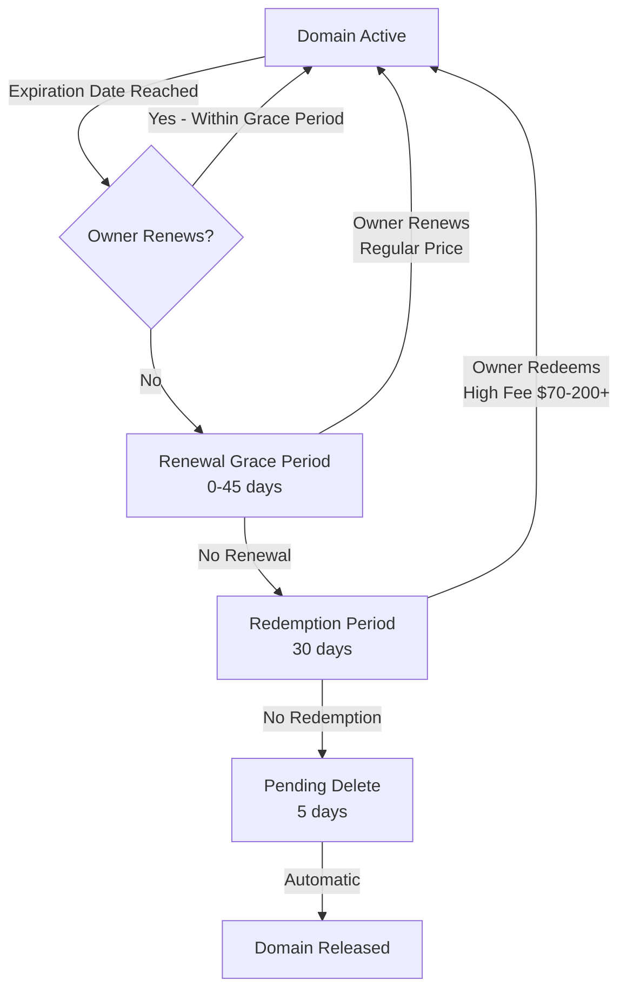
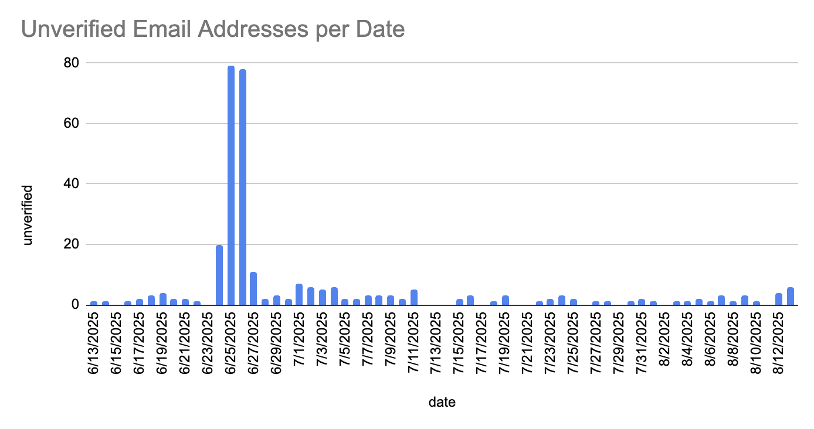

## Summary

PyPI now checks for expired domains to prevent domain resurrection attacks,
a type of supply-chain attack where someone buys an expired domain
and uses it to take over PyPI accounts through password resets.

These changes improve PyPI's overall account security posture,
making it harder for attackers to exploit expired domain names
to gain unauthorized access to accounts.

<!-- more -->

Since early June 2025, PyPI has unverified over 1,800 email addresses
when their associated domains entered expiration phases.
This isn't a perfect solution, but it closes off a significant attack vector
where the majority of interactions would appear completely legitimate.

## Background

PyPI user accounts are linked to email addresses.
Email addresses are tied to domain names;
domain names can expire if unpaid, and someone else can purchase them.

During PyPI account registration, [users are required to verify their email addresses](https://policies.python.org/pypi.org/Terms-of-Service/#2-required-information)
by clicking a link sent to the email address provided during registration.
This verification ensures the address is valid and accessible to the user,
and may be used to send important account-related information,
such as password reset requests, or for PyPI Admins to use to contact the user.

PyPI considers the account holder's initially verified email address a strong indicator of account ownership.
Coupled with a form of Two-Factor Authentication (2FA), this helps to further secure the account.

Once expired, an attacker could register the expired domain, set up an email server,
issue a password reset request, and gain access to accounts associated with that domain name.

Accounts with any activity after [January 1 2024 will have 2FA enabled](2024-01-01-2fa-enforced.md),
and an attacker would need to have either the second factor,
or perform a full account recovery.

For older accounts prior to the 2FA requirement date,
having an email address domain expire could lead to account takeover,
which is what we're attempting to prevent,
as well as minimize potential exposure if an email domain _does_ expire and change hands,
regardless of whether the account has 2FA enabled.

This is not an imaginary attack - this has happened at least once for [a PyPI project](https://osv.dev/vulnerability/PYSEC-2022-199) back in 2022,
and [other package ecosystems](https://blog.illustria.io/illustria-discovers-account-takeover-vulnerability-in-a-popular-package-affecting-1000-8aaaf61ebfc4).

**TL;DR: If a domain expires, don't consider email addresses associated with it verified any more.**

## Domain Expiration Timeframe

Here's a generalized flowchart of phases that domain name registrars often adhere to.
There's typically a grace period before a domain is deleted.
Read more about [ICANN's Expired Registration Recovery Policy (ERRP)](https://www.icann.org/resources/pages/registrant-about-errp-2018-12-07-en).

One way to visualize this can be seen in the below flowchart:

The word "expiration" might be a bit overloaded,
as conceptually there is no specific state advertised that a domain name has expired,
rather using other indicators we can infer what state the domain name is currently in.

Thanks to our friends at [Domainr](https://domainr.com/) (a Fastly service),
we can use their [Status API](https://domainr.com/docs/api/v2/status#status-results)
to issue periodic queries for any given domain, and act on the response.

The time interval we've chosen for now is 30 days, as per the flow above,
there's a high likelihood that a domain is still in the Renewal Grace Period
or Redemption Period when we check for status,
and can react before it is released or changes hands.

_Note_: PyPI will not detect a non-expiring domain transfer,
as we assume the parties are acting together to transfer a domain legitimately.

## PyPI Actions

After an initial bulk check period that took place in April 2025,
PyPI will check daily for any domains in use for status changes,
and update its internal database with the most recent status.

If a domain registration enters the redemption period,
that's an indicator to PyPI that the previously verified email destinations may not be trusted,
and will un-verify a previously-verified email address.
PyPI will not issue a password reset request to addresses that have become unverified.

Since the initial implementation early June 2025,
PyPI has unverified over 1,800 email addresses (initial 1,500 excluded from chart),
and will continue to do so daily, to protect both PyPI account holders,
as well as the end users of PyPI packages.

## Recommendations for end users

If your PyPI account only has a **single verified** email address from a custom domain name,
add a **second verified** email address from another notable domain (e.g. Gmail) to your account.

During a PyPI account recovery, PyPI may ask for other proofs,
often via other services under the user's control.
If the same email address is used on those other services, the recovery could appear legitimate.
Ensure you have 2FA set on those services as well to prevent potential account takeovers.

## That's all for now, folks

While these changes are not foolproof,
they decrease the likelihood of domain resurrections account takeovers.

Thanks to Eric Case at [Fastly](https://www.fastly.com/) for helping us understand some of the complexities
and Samuel Giddins at [Ruby Central](https://rubycentral.org/) for their initial ideas of this approach,
and the [OpenSSF Securing Software Repositories Working Group](https://repos.openssf.org/)
for their collaborative guidance on repository security.

This effort would not be possible without the continued support from [Alpha-Omega](https://alpha-omega.dev/).

### Related reading

- [Wikipedia: Domain hijacking](https://en.wikipedia.org/wiki/Domain_hijacking)
- [CAPEC-50: Password Recovery Exploitation](https://capec.mitre.org/data/definitions/50.html)
- [CAPEC-695: Repo Jacking](https://capec.mitre.org/data/definitions/695.html)
- [OpenSSF: Principles for Package Repository Security](https://repos.openssf.org/principles-for-package-repository-security)
- [arxiv: What are Weak Links in the npm Supply Chain?](https://arxiv.org/abs/2112.10165)
