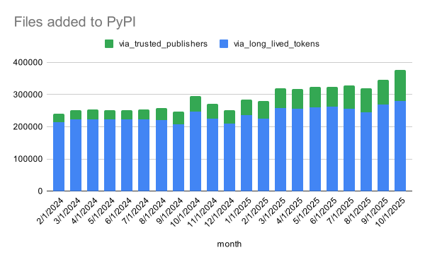
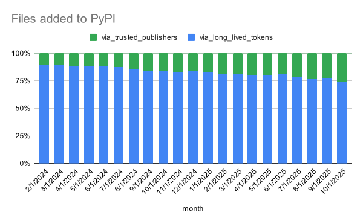

## Summary

Trusted Publishing has proven popular since [its launch in 2023](2023-04-20-introducing-trusted-publishers.md).

**Recap:** Trusted Publishing enable software build platforms to publish packages to PyPI on your behalf, 
eliminating the need to manage long-lived authentication tokens.
After a one-time setup where you delegate publishing authority to your platform, 
it automatically obtains short-lived, scoped tokens for each build—no manual token management required.

Read the [Security Model](https://docs.pypi.org/trusted-publishers/security-model/)
for a deeper understanding of how Trusted Publishing works.

## Growing Adoption and Impact

Since its inception, Trusted Publishing has been adopted by communities and companies alike,
with ~45,000 projects configured for Trusted Publishing on PyPI so far.
In early 2024 we added the ability to track whether each file upload was done via a Trusted Publisher,
enabling us to analyze its impact over time.
Also in 2024, more platforms added were added to PyPI Trusted Publishing,
as detailed in our [April 2024 blog post](2024-04-17-expanding-trusted-publisher-support.md).

<!-- more -->

Looking at data from February 2024 to October 2025, back in February 2024,
only about 10% of file uploads to PyPI were done via Trusted Publishers.
By October 2025, that number has grown to over 25%,
which shows people are really embracing this more secure way to publish.

Here's a chart displaying the overall count of files uploaded to PyPI each month,
broken down by whether they were uploaded via Trusted Publishers or not:

A couple of numbers for comparison:

* February 2024 - 241k files added
* October 2025 - 377k files added

The growth patterns are incredible - it's clear that folks really like PyPI!
The chart displays an overall growth pattern for files uploaded to PyPI,
regardless of their publishing method.
Read [this blog from the PSF Director of Infrastructure on open infrastructure growth](https://pyfound.blogspot.com/2025/10/open-infrastructure-is-not-free-pypi.html).

Displayed another way, we can stack the percentage of files uploaded by method over time:

Here we can see that back in February 2024, only about 10% of files were uploaded via Trusted Publishers.
By October 2025, that number has grown to **over 25% of all files uploaded to PyPI** in a given month.

Hopefully posts like this and increased visibility in how to adopt Trusted Publishing
will help continue this growth trend.
Having folks like [Sviatoslav Sydorenko](https://github.com/webknjaz) and other contributors voluntarily maintain
the [widely-used GitHub Actions workflow for Trusted Publishing](https://github.com/marketplace/actions/pypi-publish)
that makes everything that much easier has been a huge help, support them as well if you can!
Using that action adds [Digital Attestations](2024-11-14-pypi-now-supports-digital-attestations.md) automatically. :lock:

I hope that when we examine these stats next year, we'll see even more growth
as more organizations adopt Trusted Publishing for their package publishing workflows.

Which brings me to...

## Expansion of Trusted Publishing to GitLab Self-Managed Beta

Since folks have been loving Trusted Publishing,
I'm excited to share that it's now available in beta for GitLab Self-Managed instances.
This means organizations running their own GitLab can now use Trusted Publishers
to publish packages more securely, without dealing with long-lived tokens.

Since GitLab itself can be self-hosted,
we're initially launching this feature as a beta to gather feedback and ensure a smooth experience.
Organizations' self-hosted instances must be manually onboarded by PyPI staff during this beta phase,
while we learn more about the various configurations and setups in use.

In this scenario, the trust relationship is established between your GitLab Self-Managed instance
and PyPI, allowing GitLab CI/CD pipelines to publish packages on behalf of your organization
without the need for long-lived tokens.

If your organization runs your own GitLab Self-Managed instances and wish to publish packages to PyPI using Trusted Publishing,
we encourage you to try out Trusted Publishing and provide feedback during this beta phase.
Email [support+orgs@pypi.org](mailto:support+orgs@pypi.org)
(or click [this link for a pre-filled email](mailto:support+orgs@pypi.org?subject=PyPI%20GitLab%20Self-Managed%20Interest&body=Hi%20PyPI%20Support%2C%0A%0AOur%20organization%20%3CREPLACE%20WITH%20PyPI%20ORG%20NAME%3E%20is%20interested%20in%20the%20Trusted%20Publisher%20beta%20for%20GitLab%20Self-Managed%20Instances.%0A%0AOur%20GitLab%20Instance%27s%20URL%20is%3A%20https%3A%2F%2F%3CYOUR%20INSTANCE%20URL%3E%0AWe%20have%20confirmed%20that%20these%20endpoints%20are%20accessible%3A%0A%20%20*%20https%3A%2F%2F%3CYOUR%20INSTANCE%20URL%3E%2F.well-known%2Fopenid-configuration%0A%20%20*%20https%3A%2F%2F%3CYOUR%20INSTANCE%20URL%3E%2Foauth%2Fdiscovery%2Fkeys%0A%0ALooking%20forward%20to%20hearing%20back%20from%20you%20soon.) that you can update with your details).

## Pending Trusted Publishers for Organizations Feature

Oh, and one more thing - an important feature of PyPI Organizations is now available:

You can now create a **pending** Trusted Publisher at the Organization level.

Why does this matter? Previously, a PyPI user account creating a Pending Trusted Publisher (for a project that does not yet exist)
would become the Owner of the project once it's been uploaded by the Trusted Publisher.
This made sense for individual users, but for Organizations, it meant that the user who **created** the Pending Trusted Publisher
would become the Owner of the project once it was published,
and may overlook transferring ownership back to the Organization, which is less than ideal.

With this new feature, when creating a Pending Trusted Publisher at the Organization level,
the project will be owned by the Organization itself once it's published,
regardless of which user created the Pending Trusted Publisher.

This makes managing projects in Organizations way easier,
making sure projects belong to the Organization itself and not just whoever set things up.

If you have a PyPI Organization and wish to create a Pending Trusted Publisher,
check it out on your Organization's Trusted Publishers page, by following:

1. Navigate to your PyPI Organization's page (e.g., `https://pypi.org/organizations/<your-org-name>/`)
2. Click on the "Publishing" tab on the sidebar.
3. See the forms to create a Pending Trusted Publisher for your Organization.

All other behaviors of Pending Trusted Publishers remain the same,
see the [Trusted Publishers documentation](https://docs.pypi.org/trusted-publishers/creating-a-project-through-oidc/)
for more details.

## What's next?

We're continuing to work on making PyPI publishing safer and more secure,
so we'll keep watching how Trusted Publishing adoption grows.
During the GitLab Self-Managed beta, we'd love to hear your feedback
so we can improve things based on how you actually use it.

Some next step ideas we have, and would love your feedback on:

- Adding support for [GitHub Enterprise Server instances](https://github.com/pypi/warehouse/issues/18970)
- Adding support for [GitHub Actions Reusable Workflows](https://github.com/pypi/warehouse/issues/11096)
- Adding support for [other publishing platforms](https://github.com/pypi/warehouse/issues/18889)

For any of these, feel free to visit the related GitHub issue
and add your :thumbsup: reaction to the main issue to help us sort them by interest.

Live long, and publish! :vulcan:
