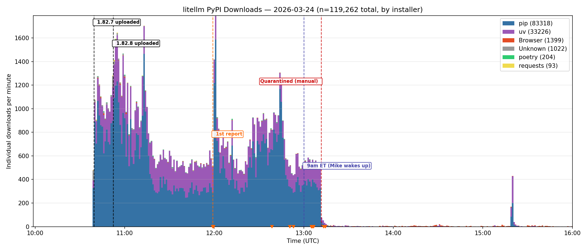
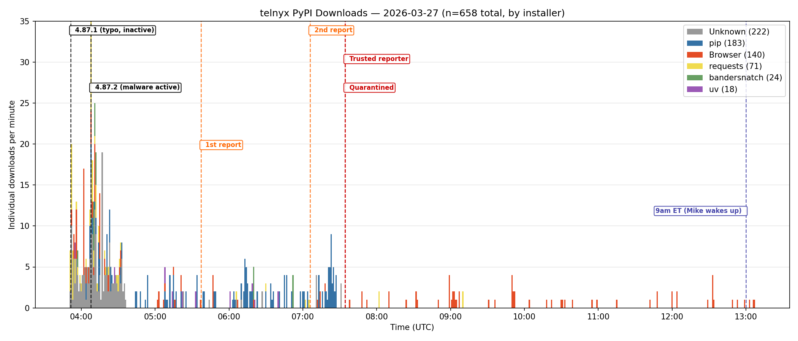

This post will drill deeper into two recent supply chain exploits, targeting users of popular PyPI packages - `litellm` & `telnyx`.
We also provide Python developers and maintainers with guidance on what they can do to prepare
and protect themselves from future incidents.

<!-- more -->

## What happened with LiteLLM and telnyx?

After an API token exposure from an [exploited Trivy dependency](https://www.aquasec.com/blog/trivy-supply-chain-attack-what-you-need-to-know/)
releases of the packages [`litellm`](https://pypi.org/project/litellm/) and [`telnyx`](https://pypi.org/project/telnyx/)
were published to PyPI containing credential harvesting malware.

The malware ran on install, harvesting sensitive credentials and files, and exfiltrating to a remote API. More details published in [the advisory for LiteLLM (PYSEC-2026-2)](https://osv.dev/vulnerability/PYSEC-2026-2), the [LiteLLM blog post](https://docs.litellm.ai/blog/security-update-march-2026) about the incident,
[the advisory for telnyx (PYSEC-2026-3)](https://osv.dev/vulnerability/PYSEC-2026-3) and the [telnyx notice](https://telnyx.com/resources/telnyx-python-sdk-supply-chain-security-notice-march-2026).

After contacting the `litellm` and `telnyx` maintainers, Mike and Seth collaborated with each team on steps forward, including token rotation, release removals, and recommendations around further security practices like using [Trusted Publishers](https://docs.pypi.org/trusted-publishers/) which both projects have since adopted.

## Why is this malware different?

This class of malware is different from most malware published to PyPI, which are mostly published as **new packages**, either as typosquats or with a plan to share the package with others and hope they install it. This malware is "injected" into open source packages that are **already in widespread use**. The malware injection occurs one of two ways:

* Targeting open source projects with insecure repositories, release workflows, or authentication
* Targeting developers installing the latest versions of open source projects and exfiltrating API tokens and keys

Using the API tokens and keys gathered from developer machines, the malware authors are able to further compromise other open source packages if API tokens for PyPI or GitHub are exfiltrated. This cycle continues as long as it is effective in exfiltrating more credentials. 

## What is PyPI doing to mitigate malware?

With daily volume of **~700-800 new projects** created daily on PyPI, this poses a scaling challenge.
PyPI partners with security researchers from our community who regularly scan and report malware through elevated channels to facilitate quicker remediation times.

Below see the timeline of events.



During the window of attack, the exploited versions of `litellm` were downloaded over 119k times.

PyPI received 13 inbound reports from concerned users, leveraging the ["Report project as malware" feature](./2024-03-06-malware-reporting-evolved.md), added back in 2024, accelrating the review/action.

- From upload to first report: 1h 19m
- First report to quarantine: 1h 12m
- From upload to quarantine (total exposure time): **2h 32m**

LiteLLM is typically installed [~15-20 million times per week](https://pepy.tech/projects/litellm?timeRange=threeMonths&category=version&includeCIDownloads=true&granularity=weekly&viewType=line&versions=*). Averaging this out to an "installs per minute" rate nets a value between **~1700 installs per minute**.
This means between **~40-50% of all installs** of LiteLLM were unpinned and fetching the latest version on each install invocation.

Because these systems are pulling latest, this leaves very little time for researchers and PyPI admins to report, triage, and quarantine malware when published to a popular package. Read on for information on "[dependency cooldowns](#dependency-cooldowns)"



PyPI's remediation response to `telnyx` was autonomously taken thanks to our pool of trusted reporters.
These reporters add weight to any given report, triggering an automated quarantine feature.
Subscribe to the PyPI blog for a future update about our automatic quarantining system.

- From upload to first report: 1h 45m
- First report to quarantine: 1h 57m
- Form upload to quarantine (total exposure time): 3h 42m

Below are a few methods to make your usage of Python packages from PyPI more secure and to avoid installing malware.

## Protecting yourself as a developer

### Dependency Cooldowns

One method to avoid "drinking from the firehose" and allow time for malware to be detected and remediated is using "Dependency Cooldowns".
Dependency cooldowns is a strategy for package installers (like `pip`, `uv`, etc) to avoid installing packages that have very recently been published to PyPI. By doing so, this allows for human operators like security researchers and PyPI admins a chance to respond to reports of malware.

Dependency cooldowns work best when they are configured "globally" on a developer machine and then passively protect developers from compromises on every invocation of pip or uv.
Setting a relative value like "3 days" ("`P3D`" per RFC 3339) means packages that are newer than 3 days will not be installed.

uv already supports [setting relative dependency cooldown](https://docs.astral.sh/uv/concepts/resolution/#dependency-cooldowns) via `--exclude-newer`. You can [configure the option globally](https://docs.astral.sh/uv/concepts/configuration-files/) (in `~/.config/uv/uv.toml`) or per-project in your `pyproject.toml`:

```toml
[tool.uv]
exclude-newer = "P3D"  # "3 days" in RFC 3339 format
```

Relative dependency cooldowns are coming soon to pip v26.1 which [should be available in April](https://pip.pypa.io/en/stable/development/release-process/) of this year. Once they are available you can set the option in [your `pip.conf` file](https://pip.pypa.io/en/stable/topics/configuration/) (`~/.config/pip/pip.conf`):

```ini
[install]
uploaded-prior-to = P3D
```

[Starting in pip v26.0](https://ichard26.github.io/blog/2026/01/whats-new-in-pip-26.0/#excluding-distributions-by-upload-time) you can set absolute dependency cooldowns with pip from the command-line, likely paired with another tool like `date` to calculate an absolute date from a relative offset like "`3 days`":

```shell
python -m pip install \
  --uploaded-prior-to=$(date -d '-3days' -Idate) \
  simplepackage
```

Applying dependency cooldowns everywhere isn't a silver bullet, though!
There are certain situations where you *do* want the latest version of a package as soon as possible, like when applying patches for vulnerabilities.
Dependency cooldowns should be paired with a vulnerability scanning strategy so security updates for your application's dependencies aren't waiting to be deployed. For example, Dependabot and Renovate both bypass dependency cooldowns by default for security updates.

You can manually bypass a dependency cooldown in pip and uv by setting a value of "the current day" to get the actual latest release:

```shell
python -m pip install \
  --uploaded-prior-to=P0D \
  simplepackage==26.3.31
```

### Locking Dependencies

Installing a package from PyPI without a "lock" means that it's possible to receive new code *every time you run pip install*.
This leaves the door open for a compromise of a package to immediately get installed and execute malware on the installing systems.

If you're a developer of an application using PyPI packages you should be using lock files both for security and reproducibility of your application.
Some examples of tools which produce lock files for applications are:

* `uv lock`
* `pip-compile --generate-hashes`
* `pipenv`

Note that `pip freeze` doesn't create a lock file, a lock file must include checksums / hashes of the package archives to be secure and reproducible.
`pip freeze` only records packages and their versions. pip is working on experimental support for the `pylock.toml` standard through the
[`pip lock` sub-command](https://pip.pypa.io/en/stable/cli/pip_lock).

## Protecting your project as an open source maintainer

If you are a maintainer of an open source project on PyPI, you can do your part to protect your users from compromises.
There are three approaches we recommend: 

1. securing your release workflows
2. using Trusted Publishers
3. adding 2FA to all accounts associated with open source development

### Securing release workflows

If you're using a continuous deployment system to publish packages to Python: these workflows are targets for attackers. You can prevent most of the danger by applying a handful of security recommendations:

* **Avoid insecure triggers.** Workflows that can be triggered by an attacker, especially with inputs they control (such as PR titles, branch titles) have been used in the past to inject commands. The trigger `pull_request_target` from GitHub Actions in particular is difficult to use securely and should be avoided.
* **Sanitize parameters and inputs.** Any workflow parameter or input that can expand into an executed command carries potential to be used by attackers. Sanitize values by passing them as environment variables to commands to avoid template injection attacks.
* **Avoid mutable references.** Lock or pin your dependencies in workflows. Favor using Git commit SHAs instead of Git tags, as tags are writeable. Maintain a lock file for PyPI dependencies used in workflows.
* **Use reviewable deployments.** Trusted Publishers for GitHub supports "GitHub Environments" as a required step. This makes publishing your package to PyPI require a review from your GitHub account, meaning a higher bar for an attacker to compromise.

If you are using GitHub Actions as your continuous deployment provider, we highly recommend the tool "[Zizmor](https://github.com/zizmorcore/zizmor/)" for detecting and fixing insecure workflows.

### Trusted Publishers over API tokens

If the platform you use to publish to PyPI supports [Trusted Publishers](https://docs.pypi.org/trusted-publishers/) (GitHub, GitLab, Google Cloud Build, ActiveState) then you should use Trusted Publishers instead of API tokens.

PyPI API tokens are "long-lived", meaning if they are exfiltrated by an attacker that attacker can use the token at a much later date even if you don't detect the initial compromise. Trusted Publishers comparatively uses short-lived tokens, meaning they need to be used immediately and don't require manual "rotating" in the case of compromise.

Trusted Publishers also provides a valuable signal to downstream users through [Digital Attestations](https://docs.pypi.org/attestations/). This means users can detect when a release *hasn't* been published using the typical release workflow, likely drawing more scrutiny.

### Adding 2FA to open source development accounts

We may be starting to sound like a broken record, but 2FA should be used for all accounts associated with open source development: not just PyPI.
Think about accounts like version control / software forges
(GitHub, GitLab, Codeberg, Forgejo) and your email provider.
[PyPI has required 2FA to be enabled to publish packages](./2024-01-01-2fa-enforced) since the beginning of 2024,
but enabling phishing-resistant 2FA like a hardware key can protect you further.

## How can you support this kind of work?

Security work isn't free. You can support security work on the Python Package Index by supporting the Python Software Foundation (PSF). If you or your organization is interested in sponsoring or donating to the PSF so we can continue supporting Python, PyPI, and its community, check out the [PSF's sponsorship program](https://www.python.org/sponsors/application/), [donate directly](https://www.python.org/psf/donations/), or contact our team at [sponsors@python.org](mailto:sponsors@python.org)!

Mike Fiedler and Seth Larson's roles as [PyPI Safety & Security Engineer and Security Developer-in-Residence](https://www.python.org/psf/developersinresidence/) at the Python Software Foundation are supported by [Alpha Omega](https://alpha-omega.dev).
