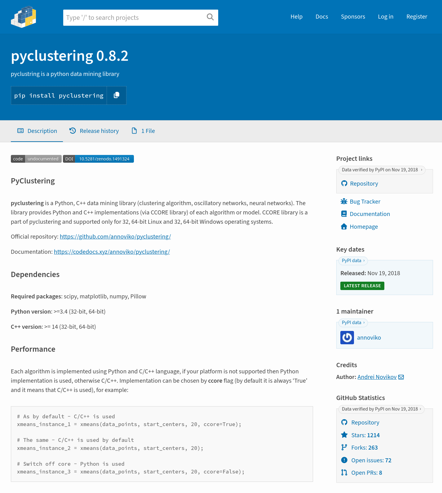

Over the next few months, we will be rolling out changes to the PyPI user interface, improving how we surface security signals and updating the pages where users view package details.

Updates will be staged to [TestPyPI](https://test.pypi.org/) and deployed to production in phases. This approach allows our team to thoroughly test the UI with production-like data, while providing the community with an opportunity to provide feedback.

The first changes will be staged today.

<!-- more -->

## Context: Research and Style Guide
Between June and October 2025, the [OpenSSF Securing Repositories Working Group](https://repos.openssf.org/) partnered with [Superbloom](https://superbloom.design/) and [Kabu&nbsp;Creative](https://kabucreative.com/) to research and develop a [style guide](https://repos.openssf.org/attestations-style-guide) for effectively displaying and communicating attestations to software repository users, including PyPI users.

The research identified that while PyPI currently supports the display of attestations, both the user interface and supporting documentation require significant updates. To address this, we are applying [level AAA (highest) recommendations from the style guide](https://repos.openssf.org/attestations-style-guide/level-aaa) to PyPI. This involves adding a new "Security" tab, while also taking the opportunity to improve security signaling for other PyPI metadata.

## What’s Changing?
Key changes include:

*   **Navigation moved to horizontal tabs:** We are moving internal navigation out of the sidebar and into a horizontal tab structure. This allows us to reserve the sidebar exclusively for metadata.
*   **Metadata sidebar moved to the right:** Shifting the sidebar to the right places the most critical content—the package description/readme—on the left, aligning with a natural left-to-right reading pattern and mirroring the structure of other major platforms like GitHub and npm.
*   **Separating Trust Levels:** We are explicitly distinguishing between official PyPI data, "Data verified by PyPI," and maintainer-provided content. This signaling will help users weigh data according to its source.
*   **Optimized Sidebar Hierarchy:** Metadata is being reordered by utility, prioritizing project links and "freshness" signals (like release dates) at the top, while shifting classification data to the bottom to reduce cognitive load.
*   **Dedicated Security Transparency:** We are introducing a new Security tab to house complex provenance and attestation metadata.
*   **Clearer Status Labeling:** Quarantined, yanked, archived, and pre-release states are now more clearly distinguished with bolder colors and improved labels.

## Our Rollout Plan
We are rolling out these changes in four phases. You can follow our progress, view the design prototypes, and participate in the discussion on our [main tracking issue (#19950)](https://github.com/pypi/warehouse/issues/19950).

*   **Phase 1: Project Details** (preview at [#19951](https://github.com/pypi/warehouse/issues/19951)) – Main page redesign for clarity and structure, including updates to the sidebar order and positioning.
*   **Phase 2: Files and Release History** (preview at [#20185](https://github.com/pypi/warehouse/issues/20185)) – Streamlining the file and release history tabs, adding attestation metadata where appropriate.
*   **Phase 3: Security Tab** (preview at [#20069](https://github.com/pypi/warehouse/issues/20069)) – Building a dedicated space for surfacing provenance and attestation data, surfacing warnings where appropriate.
*   **Phase 4: Documentation Overhaul** – Refreshing PyPI’s documentation to include security guidance and address documentation needs of different types of users.

## We Want Your Feedback
We invite you to test these changes on [TestPyPI](https://test.pypi.org/). 

If you have feedback, please share it on [this GitHub issue](https://github.com/pypi/warehouse/issues/20267).

If you find a bug or defect, please open a ticket on [our issue tracker](https://github.com/pypi/warehouse/issues). Please ensure you include browser and device details. This helps our team reproduce and fix the problem quickly.

## Acknowledgments
We are grateful for the funding provided by the [Open&nbsp;Source&nbsp;Security&nbsp;Foundation&nbsp;(OSSF)](https://openssf.org/) for this initiative.

We also want to extend a sincere thank you to the members of the Python community who participated in our [user interviews](https://github.com/pypi/warehouse/issues/20111); your insights were instrumental in shaping the rationale and execution of these designs. Volunteers included:

* Maciej Kopeć
* Yngve Moe
* Nyaosi Mogaka
* Joachim Jablon
* Samuel Mbote

Finally, thank you to the 777 people who participated in our [user survey](https://github.com/pypi/warehouse/issues/20058). Your feedback has been invaluable in shaping the design and ordering of the package metadata sidebar.
