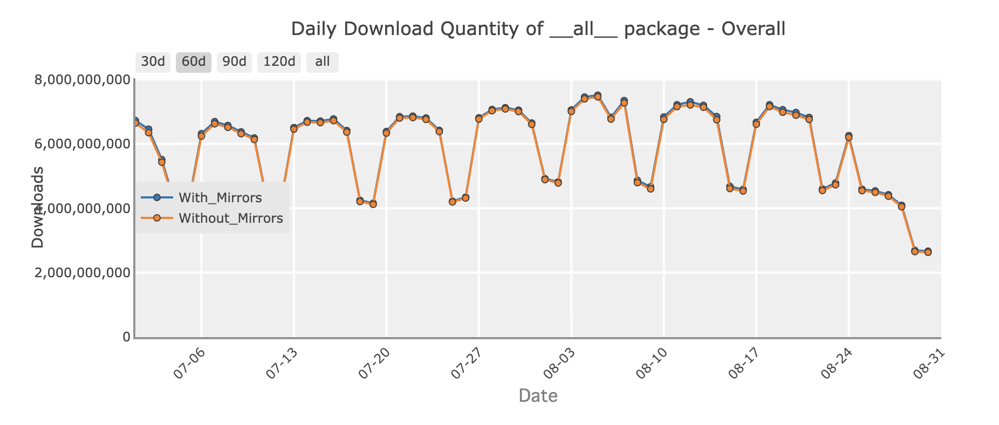

On 2026-08-24 I [shipped a change to the configuration that emits PyPI's download logs](https://github.com/pypi/infra/pull/242)
so that only requests for actual distribution artifacts are counted.
A request has to end in `.whl`, `.tar.gz`, or `.zip` to produce a download record.

The counts are more accurate now,
and existing systems like [pypistats.org](https://pypistats.org/)
will display a different curve going forward.

<!-- more -->

## Background

The logs are generated by Fastly's Edge, shipped to an AWS S3 bucket,
parsed and anonymized by our [`linehaul`](https://github.com/pypi/linehaul-cloud-function) functions in Google Cloud,
and published to a [public BigQuery dataset](https://docs.pypi.org/api/bigquery/).

## Other objects

Everything PyPI serves for a release lives under the same `/packages/<xx>/<yy>/<hash>/` prefix.
Matching on that prefix alone counted a fetch of any part of a release
as a download of the distribution itself.

- [PEP 658](https://peps.python.org/pep-0658/) `.metadata` sidecars.
  Installers may fetch these to read a wheel's metadata *without* downloading the wheel.
  Every metadata fetch was being logged as a distribution download.
- `.asc` GPG signatures. PyPI [stopped accepting these in 2023](2023-05-23-removing-pgp.md),
  but the ones uploaded before then are still served,
  and are still being fetched and counted.
- `.egg` uploads were separately [deprecated in 2023](2023-06-26-deprecate-egg-uploads.md).
  All of these remain downloadable, and none of them are counted.
- Formats frozen for upload since 2016 under [PEP 527](https://peps.python.org/pep-0527/),
  such as `.exe`, `.msi`, and `.rpm`, are about 0.7% of the files on PyPI.

## The correction

*Daily download quantity across all of PyPI, 60-day window ending 2026-08-31, from [pypistats.org](https://pypistats.org/).*

Before the change, daily totals cycled between roughly 4.5 billion on weekends
and a little over 7 billion midweek.
The curve steps down after 2026-08-24.
The last few days of that window were still settling when the chart was captured,
so read the shape of the change rather than the final data point.

## Impact on existing data

If you compare download counts across 2026-08-24, the numbers will not line up.
The counts after that date are lower and more accurate.
Nothing was lost from the historical record - the older rows in BigQuery are unchanged,
they were just measuring something broader than "someone downloaded this package".

## Downloads are not a popularity metric

Download counts are tricky to get right,
and should not be used as a proxy for criticality or popularity.
Volumes are often driven by misconfiguration of proxies or caches, CI systems running wild,
or any variety of problems that occur with software.
There's even folks out there who drive these numbers up artificially.

This change removes one source of inflation.
It does not turn the number into a measure of how many people use a package.

## Future work: range requests

A 206 Partial Content response counts exactly the same as a 200 right now.
Reading two bytes out of a wheel to inspect its ZIP central directory
is recorded as a download of the whole wheel,
alongside a client that pulled all 30 MB.

We want to record the request type and the bytes actually transferred,
so that analysis can distinguish bytes served from downloads counted.
That work is not scheduled yet.
Follow <https://github.com/pypi/linehaul-cloud-function/issues/232>
and <https://github.com/pypi/linehaul-cloud-function/issues/252>
for that.

## That's all for now, folks

If you maintain something that reads these numbers,
the discontinuity at 2026-08-24 is expected and permanent.

This effort would not be possible without the continued support from [Alpha-Omega](https://alpha-omega.dev/).
