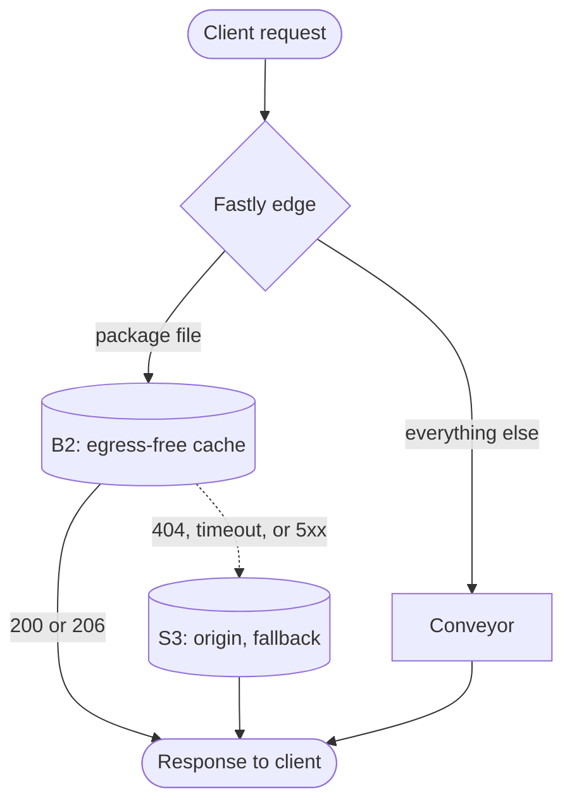
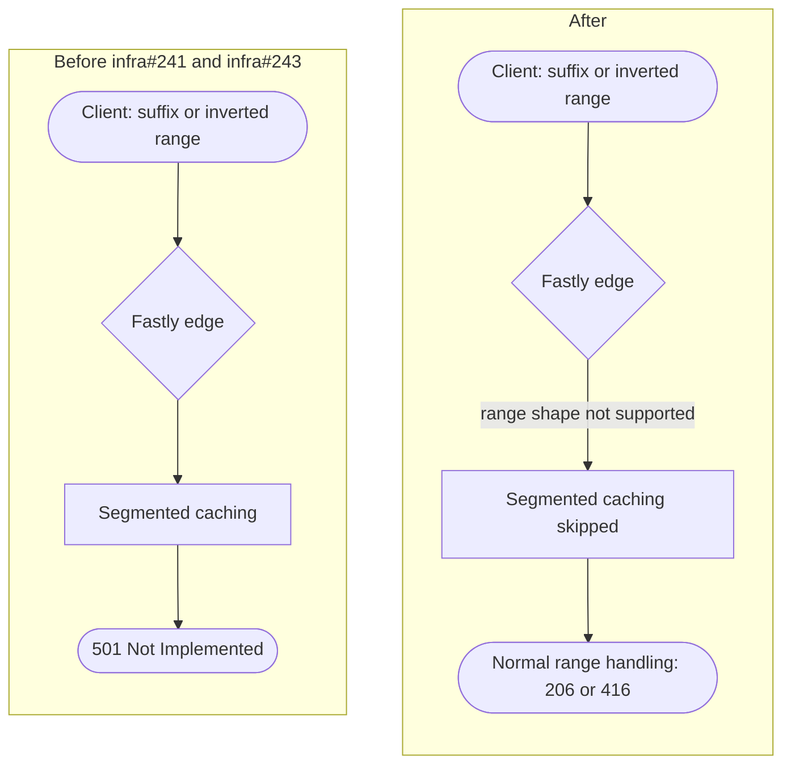
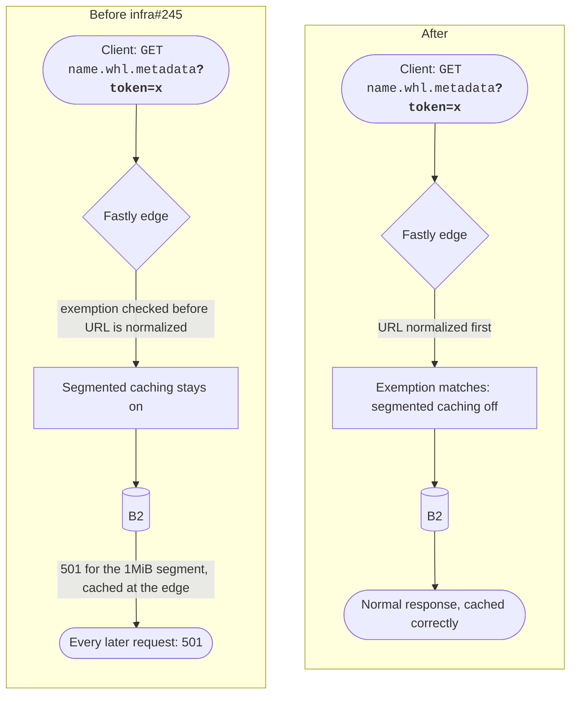
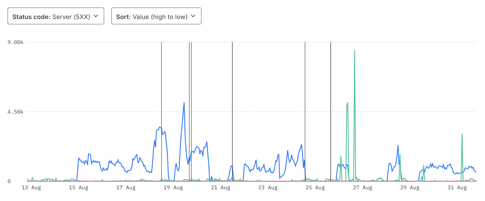
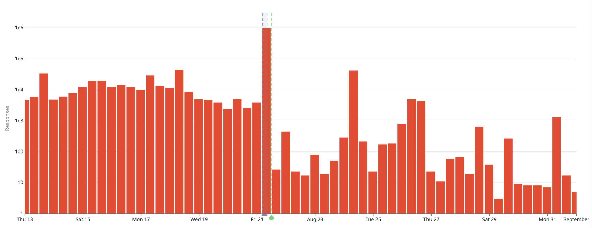

## Executive summary

For about two weeks in August 2026,
some PyPI users hit intermittent 502 and 503 errors
downloading files from `files.pythonhosted.org`,
triggering failures during installation from PyPI.
Thanks to our users filing reports in the [support tracker](https://github.com/pypi/support);
one report in particular narrowed the problem to a single cache node.

Two separate problems were uncovered.
A canary deployment inside Fastly's network
had triggered a misconfiguration at one cache node,
causing Fastly's routing layer to return 502 responses
for traffic reaching the affected cache node.
Separately, I found and fixed several bugs in our own Fastly configuration
around origin fallback and range request behavior.
Those had been there for a while,
and only surfaced while digging into these reports.

Both intermittent problems are now fixed,
and downloads are back to full function since August 28.

<!-- more -->

## Background: How PyPI's file hosting cache works [^well]

Most people run `pip install` (or your installer of choice) and it just works:
a request goes out, the desired file comes back.
Behind the scenes, `files.pythonhosted.org` is a Fastly CDN service
in front of three origins (aka 'backends').

When a file is uploaded, PyPI writes it to Amazon S3 first
as the main, durable copy.
A background job syncs it to Backblaze B2, because Fastly and Backblaze have a
[zero-cost egress agreement](https://www.fastly.com/documentation/guides/integrations/non-fastly-services/data-transfer-with-backblaze-b2/):
serving files out of B2 through Fastly doesn't cost anything beyond storage fees.

On the reader (installer) path, Fastly tries B2 first.
If B2 doesn't answer, or answers with something we don't expect,
Fastly falls back to S3.
PyPI uses the [Amazon S3 Glacier Instant Retrieval storage class](https://aws.amazon.com/s3/storage-classes/glacier/instant-retrieval/)
to balance storage and retrieval costs.
When Fastly calls S3 as a fallback, this costs more than from B2,
but will continue to work for consumers as a stop-gap.

Once cached, Fastly no longer has to check B2 or S3 - the file should never change,
and the [`Cache-Control` header](https://developer.mozilla.org/en-US/docs/Web/HTTP/Reference/Headers/Cache-Control)
sets `max-age=365000000, immutable, public` - about 11.5 years.

A third backend named Conveyor handles everything that isn't a package file request,
like [predictable URLs](https://docs.pypi.org/api/#predictable-urls),
plus a handful of legacy redirects.

That fallback path only works if the edge notices B2 has failed.
One of the bugs I fixed was that it didn't always notice correctly,
which added to the "normal" error noise.

## Timeline

### August 15

Fastly's report places the start of the problem on this Saturday,
at a single Seattle-area cache node.
This is corroborated by [#11876](https://github.com/pypi/support/issues/11876).

### August 17

The first two reports of persistent 502s from `files.pythonhosted.org` are opened,
[#11895](https://github.com/pypi/support/issues/11895)/[#11897](https://github.com/pypi/support/issues/11897).

### August 18

[#11908](https://github.com/pypi/support/issues/11908)
adds a detailed reproduction, showing
88 recorded 502s over six hours,
across 32 unrelated packages,
including the small `.whl.metadata` range requests installers use to read [PEP 658 metadata](https://peps.python.org/pep-0658/).
With three open network reports,
I go digging in Datadog Logs for the corresponding PyPI Files errors
and find nothing of consequence.
[infra#237](https://github.com/pypi/infra/pull/237) merges,
fixing the B2-to-archive failover
for the case where B2 doesn't respond at all,
rather than responding with an error.

### August 19

[#11925](https://github.com/pypi/support/issues/11925)
isolates the problem to one Fastly cache node, `cache-pae2080020`:
502 for every request routed to it, for over 19 hours,
confirmed by `x-served-by` headers on the failing responses.
Fastly's network operations removes a routing override
sending a slice of our traffic to the affected point of presence.
[infra#238](https://github.com/pypi/infra/pull/238) merges,
improving the logging configuration for the file hosting service.
[infra#239](https://github.com/pypi/infra/pull/239) merges,
rejecting HTTP methods that have no business hitting a file host.

### August 20

Fastly observes recovery at the affected point of presence,
and later confirms the elevated error rate has stopped.

### August 21

[infra#241](https://github.com/pypi/infra/pull/241) merges,
exempting suffix and multi-range requests from segmented caching,
after a morning spike traced to a single client sending logically invalid ranges.

### August 24

[infra#243](https://github.com/pypi/infra/pull/243) merges,
after two broken parallel downloaders generated 41,315 more of the same class of error in a single day.

### August 28

Fastly patches the underlying canary configuration bug on their side,
and excludes all PSF traffic, including PyPI, from their canary cohort.
[infra#245](https://github.com/pypi/infra/pull/245) merges,
fixing a URL-normalization ordering bug
that let a bad segmented-caching response get cached
and served to every subsequent request for the same file.

## Contributing factors

### POP goes the canary [^or]

Fastly runs a canary cohort,
a subset of their fleet running caching and routing software ahead of a full rollout.
PyPI's traffic had been part of that cohort for a number of years,
helping Fastly engineering validate changes.

A partial rollback during a canary deployment
left the caching configuration on one Seattle point of presence (POP) reverted
while the routing configuration in front of it was not.
The mismatch caused that routing layer to return 502s.

Fastly has since removed all PSF traffic, including PyPI, from the canary program.
We'd like to get back to participating eventually,
once clearer controls and notifications exist around this traffic.
It's a reasonable way to help Fastly validate infrastructure changes before they hit everyone,
and it hasn't cost us much before now.

### Bugs at home

While that was going on,
I found unrelated bugs in our own configuration that produced the same symptom:
elevated 502s, and in a few cases 501s that looked like 502s from outside.

The archive fallback in the diagram above
only ran when B2 answered with an error status.
If B2 didn't answer at all (a timeout, a refused connection, a TLS failure),
Fastly synthesized its own 503
and skipped straight past the code that would have tried the archive.
Package files are immutable,
so there was never a "try the archive" path for that case
until [infra#237](https://github.com/pypi/infra/pull/237) added one.

Separately, we use [segmented caching](https://www.fastly.com/documentation/guides/full-site-delivery/caching/segmented-caching/)
to avoid pulling a full gigabyte-sized wheel into cache
only to serve a `Range` request for partial content.
That feature has narrower support for range syntax than HTTP does in general:
it can't answer a suffix range (`bytes=-1024`, read the last N bytes)
or a request with the start of the range past the end,
and returns a synthetic 501 for either.
Some installers use exactly this kind of suffix range
to read wheel metadata without downloading the whole file,
so those reads were failing outright until I started exempting them:

A 501 for a malformed client request is the wrong status class.
I've opened a support ticket with Fastly about the segmented-caching range handling.
Once fixed, my handling code can probably be reverted.

Another bug: an existing segmented caching exemption check
ran before the request URL was normalized,
so a `.metadata` request with a query string still on it didn't match,
kept segmented caching enabled,
and got a 501 back from the archive backend for what should have been a normal fetch:

[infra#245](https://github.com/pypi/infra/pull/245)
moved the exemption check after URL normalization to close that hole.

None of these were new bugs.
They'd been in the configuration already,
and it took real traffic on large files with range requests
to trigger investigation and resolution.

## 5xx volume over time

Fastly's own real-time analytics for the file hosting service
show B2 errors (blue) climbing from August 15 onward
while the S3 archive backend (pink) stays flat at zero,
because the fallback that should have been routing failures there wasn't firing yet:

Our own Datadog metric shows a fuller story,
from before the incident to past the end of it:

Note the log scale.
The baseline was already noisy before any of this started,
thousands to tens of thousands of 5xx responses,
which is why the increase starting August 15 is easy to miss.
The August 21 spike is the one that isn't:
a single client sending logically invalid ranges,
pushing the count to close to a million.

The cliff immediately after it is
[infra#241](https://github.com/pypi/infra/pull/241).
Traffic past that point sits two to three orders of magnitude below the pre-incident baseline,
tens to hundreds of errors rather than thousands.
Some of what we'd been treating as background noise was this bug running the whole time.

## Going forward

The Python Software Foundation is hiring an infrastructure engineer
to add to the engineering staff of four.
Part of their remit will be PyPI,
which should help us catch conditions like this earlier and prevent rather than react.
The continued financial support from our community - individuals and companies alike - makes that possible.

A lot of the traffic hitting `files.pythonhosted.org`
is CI jobs installing the same dependencies they installed last run,
and a large share of that can be traced back to GitHub Actions runs.
If you're not already caching those downloads, it's worth turning on:
`setup-python`'s
[pip, pipenv, and poetry caching](https://github.com/actions/setup-python/blob/main/docs/advanced-usage.md#caching-packages)
is opt-in via the `cache` input, off by default,
and `setup-uv`'s
[caching](https://github.com/astral-sh/setup-uv/blob/e105c8fb1d7b13074b851babdaef4185243c6a07/docs/caching.md)
defaults to on for most GitHub-hosted runner events, but is worth checking.
An unchanged dependency that's cached doesn't touch us on the next run at all,
which means fewer requests for us to serve,
and one less thing that can break your build if we or Fastly have a rough day.

## Thanks

Thanks to everyone who took the time to file an issue and capture the details
instead of just working around the problem.

If you run into file-hosting issues in the future,
[pypi/support](https://github.com/pypi/support/issues) is still the right place,
and the more detail you can include (especially `x-served-by` headers and timestamps),
the faster we can act on it.

This work would not be possible without generous donations, please consider
[supporting the PSF](https://www.python.org/psf/) to keep this kind of
infrastructure running.
Thanks to [Alpha-Omega](https://alpha-omega.dev/), which sponsors my role.

[^well]: or, how it's _supposed_ to work

[^or]: while not perfectly accurate, I couldn't resist.
