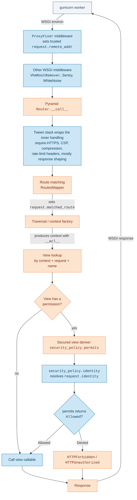
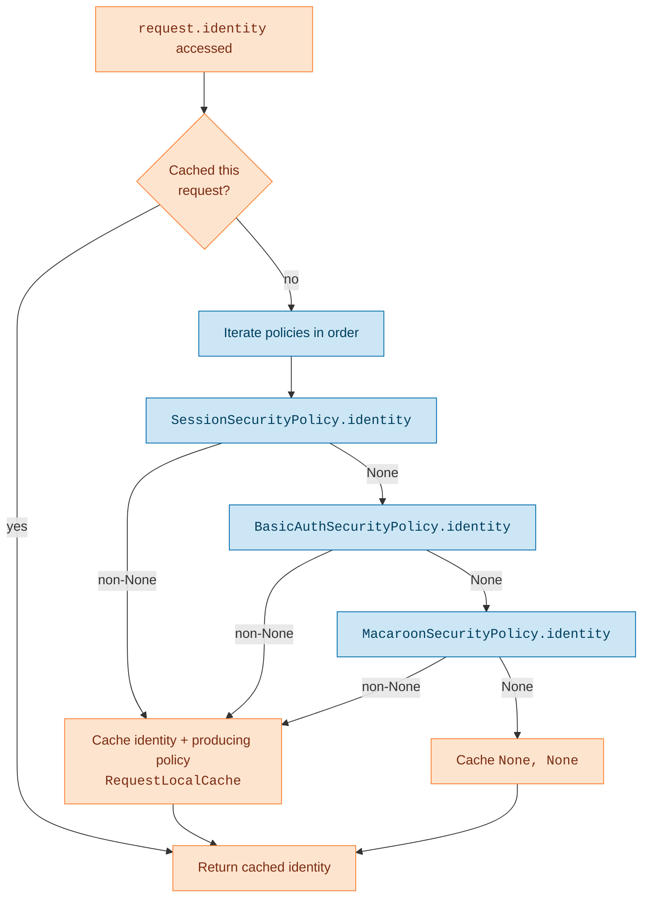
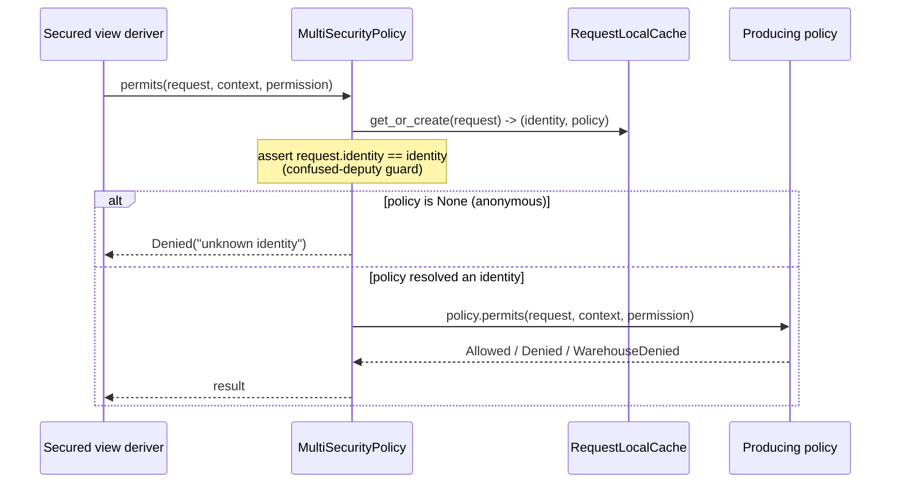
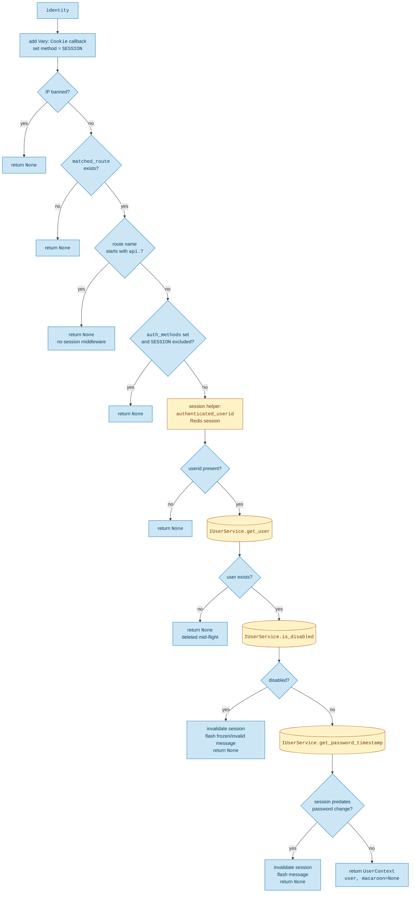
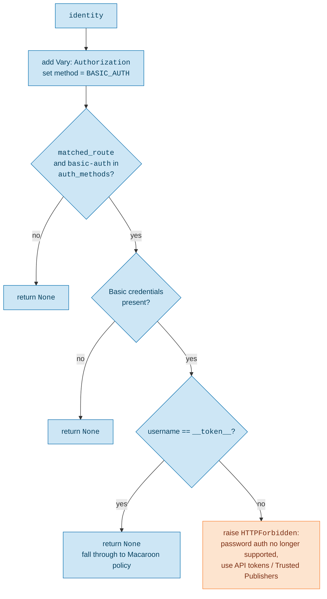
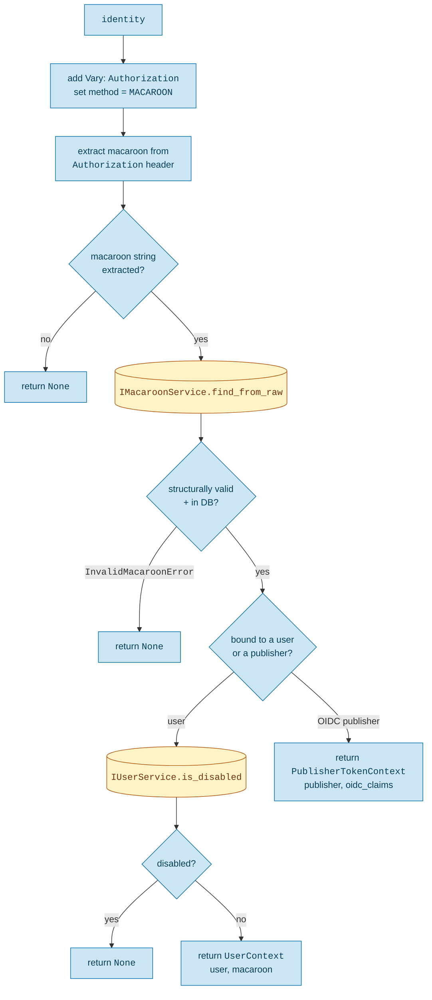
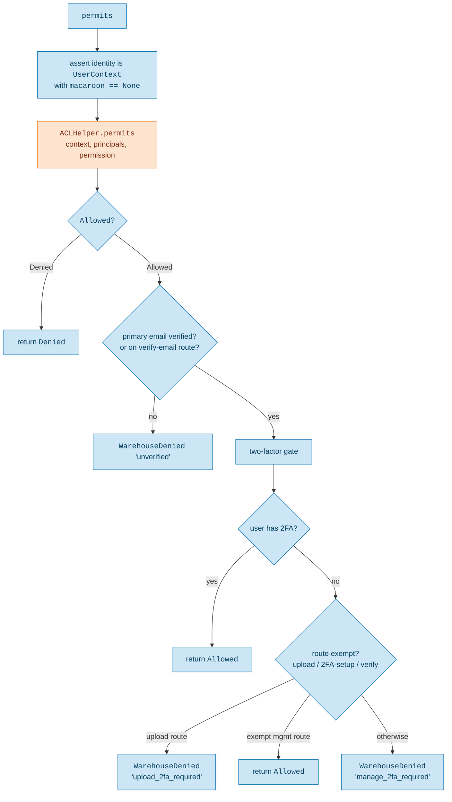
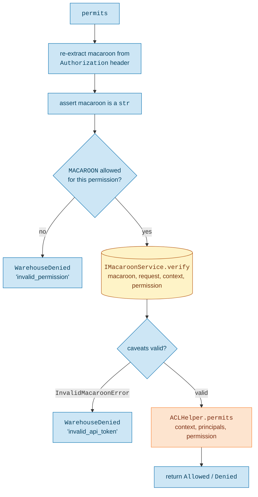
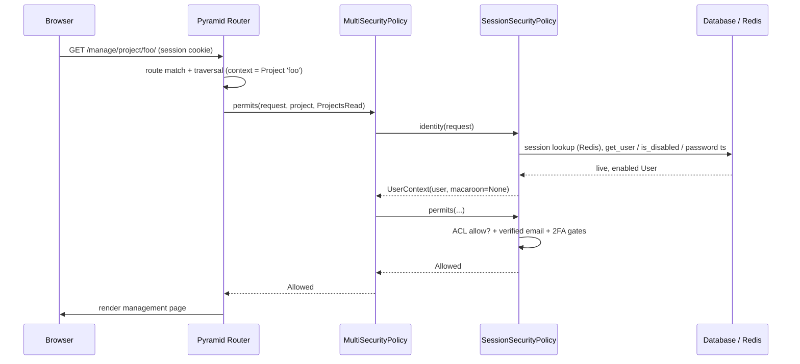
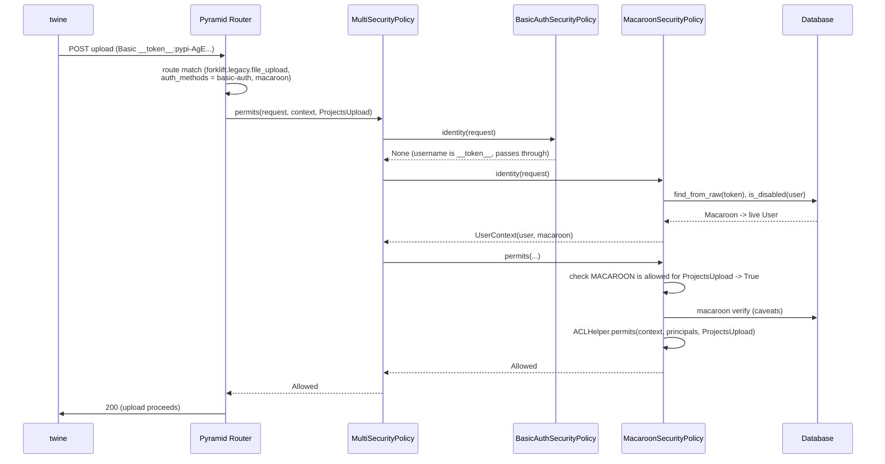

# Security Policy Flow

This document traces how an HTTP request is authenticated and authorized in
Warehouse, starting from the moment gunicorn hands a WSGI request to the
Pyramid application. It covers how Pyramid's internals call into our security
policies, how identities are resolved, and how ACLs and the other gates (route
`auth_methods`, two-factor, verified email, macaroon caveats) combine to allow
or deny a request.

> This list is the single place that maps the concepts below to files (linked on
> `main`). The prose and diagrams name symbols, not paths, so moving a file only
> means updating an entry here.

- [`warehouse/accounts/__init__.py`](https://github.com/pypi/warehouse/blob/main/warehouse/accounts/__init__.py): registers the policy stack (`config.set_security_policy`)
- [`warehouse/utils/security_policy.py`](https://github.com/pypi/warehouse/blob/main/warehouse/utils/security_policy.py): `MultiSecurityPolicy`, `AuthenticationMethod`, `principals_for`, and the `PERMISSION_AUTH_METHODS` table with its permission/method gate
- [`warehouse/accounts/security_policy.py`](https://github.com/pypi/warehouse/blob/main/warehouse/accounts/security_policy.py): `SessionSecurityPolicy`, `BasicAuthSecurityPolicy`, and the session authorization gates (verified email, two-factor)
- [`warehouse/accounts/utils.py`](https://github.com/pypi/warehouse/blob/main/warehouse/accounts/utils.py): `UserContext`
- [`warehouse/macaroons/security_policy.py`](https://github.com/pypi/warehouse/blob/main/warehouse/macaroons/security_policy.py): `MacaroonSecurityPolicy` (API tokens and Trusted Publishing)
- [`warehouse/oidc/utils.py`](https://github.com/pypi/warehouse/blob/main/warehouse/oidc/utils.py): `PublisherTokenContext`
- [`warehouse/predicates.py`](https://github.com/pypi/warehouse/blob/main/warehouse/predicates.py): `AuthMethodsPredicate` and the `auth_methods_for_route` helper
- [`warehouse/routes.py`](https://github.com/pypi/warehouse/blob/main/warehouse/routes.py) and [`warehouse/forklift/__init__.py`](https://github.com/pypi/warehouse/blob/main/warehouse/forklift/__init__.py): route declarations tagged with `auth_methods`
- [`warehouse/config.py`](https://github.com/pypi/warehouse/blob/main/warehouse/config.py): `RootFactory` (the default context and the root ACL)
- [`warehouse/utils/wsgi.py`](https://github.com/pypi/warehouse/blob/main/warehouse/utils/wsgi.py): `ProxyFixer` (trusted client IP) and `VhmRootRemover` WSGI middleware
- [`warehouse/errors.py`](https://github.com/pypi/warehouse/blob/main/warehouse/errors.py): `WarehouseDenied`
- [`warehouse/authnz/_permissions.py`](https://github.com/pypi/warehouse/blob/main/warehouse/authnz/_permissions.py): the `Permissions` enum used throughout the ACLs

## Diagram legend

The diagrams below share one color scheme:

- <span style="background-color:#fde4cf; border: 1px solid #f98131; padding: 2px 6px;">Pyramid</span> core machinery (router, traversal, view derivers, ACL helper, per-request cache)
- <span style="background-color:#cde6f5; border: 1px solid #006dad; padding: 2px 6px;">Warehouse</span> code (our security policies and the gates they wrap around the ACL)
- <span style="background-color:#fef3c7; border: 1px solid #b45309; padding: 2px 6px;">Service data</span> via `IUserService`/`IMacaroonService`, Postgres/Redis DBs, etc
- <span style="background-color:#f1f5f9; border: 1px solid #475569; padding: 2px 6px;">External actors</span> (gunicorn, browsers, CLI clients such as `twine`)

The colors apply to the flowcharts. The interaction diagrams are drawn as Mermaid
sequence diagrams, which Material renders with a single box fill, so those are left
uncolored; read the participant names for the same categories.

## 1. From gunicorn to the security policy

gunicorn speaks WSGI to the Warehouse application object.
That object is the Pyramid `Router`, wrapped in our own stack of WSGI
middleware and Pyramid tweens.

Most of that wrapping is transport and response shaping (compression, CSP and
referrer headers, conditional GETs, rate-limit headers) and has nothing to do
with who you are. The one piece that matters for auth is `ProxyFixer`, a WSGI
middleware that runs before the router and establishes the trusted
`request.remote_addr` from our proxy headers. `SessionSecurityPolicy` later
refuses to authenticate a banned IP, so that ban check is only as trustworthy
as `ProxyFixer`.

Authentication and authorization themselves **are not middleware**. They run
*inside* the router, after the route and the context resource have been
resolved, and only when a view declares a `permission`.



Two Pyramid concepts do the work here:

- **Traversal and the context factory.** Every route resolves to a *context*
  resource. By default that is the `RootFactory`, whose `__acl__` carries the
  site-wide admin grants. Routes that declare a
  `factory=` and `traverse=` (for example the project routes pointing at
  `ProjectFactory`) produce a domain object such as a `Project` as the context,
  and that object supplies its own `__acl__`.
- **The secured view deriver.** When a view is registered with a `permission`,
  Pyramid wraps it so that, before the view runs, it calls
  `security_policy.permits(request, context, permission)`. If the result is not
  `Allowed`, the view never executes and Pyramid raises `HTTPForbidden` (or
  `HTTPUnauthorized` for anonymous requests).

`request.identity` is the other entry point. It is computed lazily the first
time anything touches it (the permits machinery, a subscriber, `request.user`,
a template) by calling `security_policy.identity(request)`.

## 2. The policy stack: `MultiSecurityPolicy`

Pyramid 2.x uses a single `ISecurityPolicy` object that answers both
authentication (`identity`, `authenticated_userid`) and authorization
(`permits`). Warehouse registers a `MultiSecurityPolicy` that wraps three
concrete policies, tried in order:

```python
config.set_security_policy(
    MultiSecurityPolicy(
        [
            SessionSecurityPolicy(),
            BasicAuthSecurityPolicy(),
            MacaroonSecurityPolicy(),
        ],
    )
)
```

`MultiSecurityPolicy` caches both the resolved identity *and the policy that
produced it* for the lifetime of the
request, using a `RequestLocalCache`. That pairing matters: the same policy
that authenticated the request is the one asked to authorize it.



The combinator semantics:

- `identity` is the first non-`None` result from the policies, in order.
- `authenticated_userid` returns the user id only when the identity is a
  `UserContext` (a deliberate contract bend, noted in a `TODO` in the code,
  because many views still use it as a "user or not" check).
- `forget` and `remember` are concatenated across all policies.
- `permits` is delegated to the single policy that produced the identity.

The `permits` path includes a confused-deputy guard: it re-reads the cached
`(identity, policy)` pair and asserts `request.identity == identity` before
dispatching, so a mismatch between the cached identity and the live request
identity fails loudly rather than silently authorizing the wrong principal.



## 3. Route `auth_methods`: deciding which policy may engage

A request to `/manage/account/` and a request to a forklift upload endpoint
should not be authenticated the same way. A browser cookie has no business
authenticating an upload, and an API token has no business driving the
management UI. The `auth_methods` route predicate makes that explicit on the
route itself.

`AuthMethodsPredicate` is a *storage-only* predicate. Its `__call__` always
returns `True`, so it never affects which route matches. It exists purely so the
security policies can read it back off `request.matched_route.predicates` via
`auth_methods_for_route(route)`. A route opts in by passing `auth_methods` to
`add_route` or `add_legacy_action_route`. The forklift upload, for example,
accepts basic-auth (for the `__token__` pass-through) and macaroons:

```python
config.add_legacy_action_route(
    "forklift.legacy.file_upload",
    "file_upload",
    auth_methods={"basic-auth", "macaroon"},
    domain=forklift,
)
```

A token-only API route passes `auth_methods={"macaroon"}` instead.

Each policy consults the predicate during `identity()` and bows out when its
method is not in the route's allowed set:

| Route declares | Session engages? | BasicAuth engages? | Macaroon engages? |
|----------------|------------------|--------------------|-------------------|
| *(no `auth_methods`)* | yes | no (needs explicit opt-in) | yes |
| `{"basic-auth", "macaroon"}` (forklift upload) | no | yes | yes |
| `{"macaroon"}` (token-only API) | no | no | yes |

`auth_methods_for_route` returns `None` when a route carries no predicate, and
each policy decides its own default for that case. `SessionSecurityPolicy` and
`MacaroonSecurityPolicy` still engage on un-tagged routes; `BasicAuthSecurityPolicy`
only engages when a route explicitly lists `basic-auth`.

## 4. Authentication: resolving `request.identity`

Every policy's `identity()` does two things up front regardless of outcome: it
registers a `Vary` response callback (on `Cookie` for sessions, `Authorization`
for the header-based policies) so caches don't serve one user's response to
another, and it stamps `request.authentication_method` for downstream logging
and metrics.

### 4a. `SessionSecurityPolicy`

This is the browser path. The session itself is backed by Redis; the user
record and its security state come from the database via `IUserService`.



The database reads on the happy path are `get_user`, `is_disabled`, and
`get_password_timestamp`. A session can be cryptographically valid yet still be
rejected here because the underlying account was frozen, disabled, deleted, or
had its password changed after the session was minted.

### 4b. `BasicAuthSecurityPolicy`

HTTP Basic password auth is no longer accepted. This policy exists to turn it
into a clear error instead of a confusing failure, and to let API tokens pass
through to the macaroon policy.



This policy never produces an identity. It either declines (returning `None`)
or raises `HTTPForbidden`. The `__token__` username is the agreed sentinel that
means "the password field carries an API token", so it is passed through for
`MacaroonSecurityPolicy` to handle.

### 4c. `MacaroonSecurityPolicy`

This is the API path: `twine upload`, Trusted Publishing from CI, and other
token-authenticated API endpoints. The token arrives in the `Authorization`
header, either as `Basic` with username `__token__`, or as `token`/`bearer`.



Note that `identity()` here only proves the token *exists* and maps to a live
principal. It does not yet verify the macaroon's caveats. That happens in
`permits()`, because caveat verification depends on the specific context and
permission being requested.

## 5. Authorization: how `permits` decides

Once an identity exists and the requested permission is known, the producing
policy's `permits()` runs. Both user-backed policies ultimately consult the
same ACL machinery (`pyramid.authorization.ACLHelper`), but they wrap it with
different gates.

### Principals and the ACL

`principals_for(identity)` asks the identity for its principals via
`__principals__()`:

- A `User` returns `[Authenticated, "user:<id>", ...group memberships]`, where
  groups like `group:admins`, `group:moderators`, `group:support`,
  `group:psf_staff`, and `group:observers` derive from account flags.
- A `PublisherTokenContext` returns `[Authenticated, "oidc:<publisher id>"]`.

`ACLHelper.permits(context, principals, permission)` walks the context's
`__acl__` list of `(Allow|Deny, principal, permissions)` entries and returns
`Allowed` or `Denied` based on the first matching entry. The context is
whatever traversal produced: `RootFactory` for site-wide permissions, or a
domain object such as a `Project` or `User` for object-scoped permissions.

### 5a. Session authorization



Two gates sit on top of the ACL result, and they only ever *downgrade* an
`Allowed` to a denial, never the reverse:

- **Verified email.** An `Allowed` becomes `WarehouseDenied("unverified")`
  unless the user has a verified primary email, with carve-outs for the
  verify-email and unverified-account routes so users can get unstuck.
- **Two-factor.** If the ACL allowed the action but the user has no 2FA
  configured, the request is denied, with a tailored message for the upload
  endpoint and exemptions for the routes used to set up 2FA.

### 5b. Macaroon authorization



The macaroon path has its own front gate,
`permission_allowed_by_authentication_method`, backed by the
`PERMISSION_AUTH_METHODS` table:

```python
PERMISSION_AUTH_METHODS = {
    Permissions.ProjectsUpload: frozenset({MACAROON, BASIC_AUTH}),
    Permissions.APIEcho: frozenset({MACAROON}),            # legacy API permission, slated for removal
    Permissions.APIObservationsAdd: frozenset({MACAROON}), # legacy API permission, slated for removal
}
```

Anything not in the table defaults to SESSION-only, so an API token cannot be
used to drive ordinary browser-flow permissions even if it somehow reached the
ACL. After that gate, `IMacaroonService.verify(...)` checks the macaroon's
embedded caveats against this specific request, context, and permission (for
example a token scoped to a single project, or an expiry caveat). Only then
does the same `ACLHelper.permits` run that the session path uses.

The macaroon `verify` is where Trusted Publishing caveats and project-scoped
token caveats are enforced, distinct from the ACL question of "does this
principal have this permission on this object".

## 6. Two end-to-end examples

### Browser managing a project



### CLI upload with an API token



## 7. Key types at a glance

| Type | Meaning |
|------|---------|
| `MultiSecurityPolicy` | Tries policies in order, caches `(identity, policy)`, delegates `permits` |
| `UserContext` | A `User` plus an optional `Macaroon`; `macaroon=None` means session auth |
| `PublisherTokenContext` | An OIDC publisher plus signed claims (Trusted Publishing) |
| `AuthenticationMethod` | `SESSION`, `BASIC_AUTH`, `MACAROON`, `API_KEY` (placeholder) |
| `AuthMethodsPredicate` | Storage-only route tag listing which methods may authenticate the route |
| `PERMISSION_AUTH_METHODS` | Which auth methods may grant which permissions (default: session-only) |
| `WarehouseDenied` | A `Denied` subclass carrying a human message and a machine `reason` |
| `RootFactory` | Default context resource; its `__acl__` holds site-wide admin grants |

## 8. Things worth remembering

- Authentication and authorization run inside the router, after route matching
  and traversal, and only for views that declare a `permission`. There is no
  authentication middleware.
- `identity()` proves *who* you are; `permits()` proves *what you may do*. For
  macaroons the split is sharper: existence is checked in `identity()`, caveats
  in `permits()`.
- The same policy that authenticates a request authorizes it. The cached
  `(identity, policy)` pair plus the `request.identity == identity` assertion
  guard against confused-deputy mistakes.
- Route `auth_methods` is the lever for keeping browser, password, and token
  auth from bleeding across surfaces. Adding a new authenticated API surface
  means a new `AuthenticationMethod` and a `PERMISSION_AUTH_METHODS` entry, not
  a new `MACAROON` grant.
- The session path layers verified-email and two-factor gates on top of the
  ACL; the macaroon path layers the permission/method gate and caveat
  verification. Both can only turn an ACL `Allowed` into a denial, never widen
  it.
