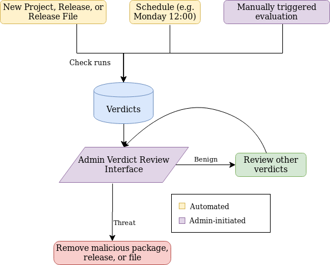
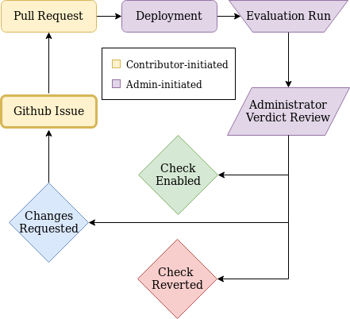

Malware Checks
==============

.. contents::
    :local:

Overview
------------
This is a high-level diagram of the automated malware check system.

|VerdictLifecycle|

Checks can be triggered in the following ways:

* A PyPI user uploads a new File, Release or Project;
* A schedule;
* A PyPI administrator initiates an evaluation run.

All of the above triggers call the `IMalwareCheckService`_
factory to determine how to execute the check. On production, the
`DatabaseMalwareCheckService`_ is returned, which runs the check and
produces one or more verdicts. PyPI administrator and moderators
continuously review verdicts in the Warehouse admin, make determinations
about the accuracy of checks, and take further action if needed (e.g. to
remove a malicious package surfaced by a verdict).

Contributing
------------

Check Lifecycle
~~~~~~~~~~~~~~~
|CheckLifecycle|

Ideas for new malware checks should first be shared by `opening an
issue`_. This will initiate a discussion with PyPI administrators and among
the broader Python community about the impact of the proposed check. After
soliciting feedback, `open a pull request to master`_ containing the
code for the new check, unit tests, and accompanying documentation. Once
the code is reviewed and merged, it will automatically be deployed to
production. PyPI administrators can begin evaluating the malware check by
moving it into the `evaluation` state in the check admin and triggering
an evaluation run.

The evaluation run generates verdicts, which are viewable in the verdicts
admin. After reviewing the verdicts, the administrator will make a
determination and communicate it to the check developer in the initial
issue. Here are the possible outcomes:

* The check provides a low-quality or noisy signal (e.g. many false
  positives), and should be removed. At this point, the check will be
  moved into a `wiped_out` state, removing all verdicts generated by the
  evaluation run, and the code for the check will be removed in the next
  release.
* The check provides a useful signal, but requires modifications. The
  administrator will request changes in the initial issue.
* The check provides a useful signal, and the administrator enables it.

Adding New Checks
~~~~~~~~~~~~~~~~~
All active checks are defined as classes in the
`warehouse/malware/checks/`_ directory, and exported from
``__init__.py``. The checks in `tests/common/checks/`_ can serve as
templates for developing new checks. Simply copy/paste the desired check
template into `warehouse/malware/checks/`_ and edit the `dunder init file`_
to get started. Complex checks that consist of more than a signle file
should be housed in a subdirectory of `warehouse/malware/checks/`_.

All malware check classes should inherit from
``warehouse.malware.checks.base.MalwareCheckBase``, define a `scan`
method, and set the following fields as class attributes:

* ``version`` - ``1`` for new checks, incrementing by one with every
  subsequent change
* ``short_description`` - a terse description of the check's purpose
* ``long_description`` - a more detailed rationale for the check
* ``check_type`` - either ``"event_hook"`` or ``"scheduled"``

For each check type, there is an additional required attribute:

* ``hooked_object``- only for ``event_hook`` checks. The name of the object
  whose creation triggers a check run. Currently ``"File"``, ``"Release"``,
  and ``"Project"`` are supported.
* ``schedule`` - only for ``scheduled`` checks. This should be represented
  as a dictionary that is passed to a `celery crontab`_.

In ``event_hook`` checks, the id of the ``hooked_object`` will be passed
to the ``scan`` method as ``obj_id`` within ``**kwargs``, and should
be propagated to the verdict. The `MalwareVerdict model`_ contains more
information about required and optional verdict fields.

Modifying Existing Checks
~~~~~~~~~~~~~~~~~~~~~~~~~
Every time that the code for an existing check is modified, the developer
should increment the check version number. This is to ensure that each
verdict is associated with a particular version of a check.

Workflow and Testing
~~~~~~~~~~~~~~~~~~~~
There are a few steps for executing new malware checks in a development
environment:

#. Complete the `Getting Started`_ instructions to setup a Warehouse
   development environment
#. Open `dev/environment`_ and set the ``MALWARE_CHECK_BACKEND`` variable

    .. code-block:: bash

      MALWARE_CHECK_BACKEND=warehouse.malware.services.DatabaseMalwareCheckService

   In the development environment, Warehouse by default will only print
   the name of the queued check instead of executing it.

#. Add your new malware check to the database.

    .. code-block:: bash

      docker-compose run web python -m warehouse malware sync-checks

#. Start Warehouse

    .. code-block:: bash

      make serve

#. Login to Warehouse in the browser as ``ewdurbin:password`` and navigate
   to ``/admin/checks``
#. Click on the check name and set the check state to ``evaluation``
#. Run an evaluation
#. View the results of the evaluation at ``/admin/verdicts``
#. For hooked checks, it may be useful to run the check against an object
   (e.g. File, Release, or Project) that triggers a ``threat`` verdict. Set
   the check state to "enabled" in the check admin and upload some malicious
   content with `twine`_. For example, if you're running Warehouse locally,
   upload a malicious file by running the following command from the
   directory containing your built package.

    .. code-block:: bash

      twine upload --repository-url http://localhost/legacy/ dist/*

Once you've manually validated the basic functioning of your check,
add tests to the `tests directory`_. See `Submitting Patches`_ for more
information about how to contribute.

Existing Checks
---------------
Currently, there are two enabled checks in Warehouse.

SetupPattenCheck
~~~~~~~~~~~~~~~~
`SetupPatternCheck`_ is an ``"event_hook"`` check that scans the ``setup.py``
file of source distributions upon file upload for potentially malicious
code that would execute automatically upon package install.

PackageTurnoverCheck
~~~~~~~~~~~~~~~~~~~~
`PackageTurnoverCheck`_ is a ``"scheduled"`` check that runs daily to look
for suspicious user behavior around package ownership.

Historical Context
------------------

In September 2019, the Python Software Foundation issued a `Request
for Proposal`_ for a system to automate the detection of malicious
uploads. This system was initially rolled out in February 2020 by `pull
request 7377`_.

.. _IMalwareCheckService: https://github.com/pypa/warehouse/blob/master/warehouse/malware/interfaces.py
.. _DatabaseMalwareCheckService: https://github.com/pypa/warehouse/blob/master/warehouse/malware/services.py
.. _celery crontab: http://docs.celeryproject.org/en/latest/reference/celery.schedules.html#celery.schedules.crontab
.. _MalwareVerdict model: https://github.com/pypa/warehouse/blob/master/warehouse/malware/models.py

.. _opening an issue: https://github.com/pypa/warehouse/issues/new?template=malware-check.md
.. _open a pull request to master: submitting-patches/
.. _tests/common/checks/: https://github.com/pypa/warehouse/tree/master/tests/common/checks/
.. _warehouse/malware/checks/: https://github.com/pypa/warehouse/tree/master/warehouse/malware/checks
.. _dunder init file: https://github.com/pypa/warehouse/tree/master/warehouse/malware/checks/__init__.py
.. _Getting Started: ../getting-started/#detailed-installation-instructions
.. _dev/environment: https://github.com/pypa/warehouse/tree/master/dev/environment
.. _twine: https://twine.readthedocs.io/en/latest/
.. _tests directory: https://github.com/pypa/warehouse/blob/master/tests/unit/malware/checks
.. _Submitting Patches: submitting-patches/
.. _SetupPatternCheck: https://github.com/pypa/warehouse/blob/master/warehouse/malware/checks/setup_patterns/check.py
.. _PackageTurnoverCheck: https://github.com/pypa/warehouse/blob/master/warehouse/malware/checks/package_turnover/check.py
.. _Request for Proposal: https://github.com/python/request-for/blob/master/2019-Q4-PyPI/RFP.md#milestone-2---systems-for-automated-detection-of-malicious-uploads
.. _pull request 7377: https://github.com/pypa/warehouse/pull/7377
