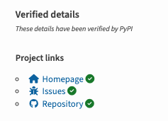
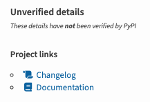

# Project Metadata

Python packages can include additional metadata to provide more information
about the project. This document outlines the specific behaviors
implemented by PyPI to display project metadata and other details. The
comprehensive list of metadata fields is available in the [Python Packaging
User Guide].

[Python Packaging User Guide]: https://packaging.python.org/en/latest/specifications/core-metadata/#core-metadata-specifications

## Project URLs

Packages owners can specify various URLs related to their project using
the [`[project.urls]` table](https://packaging.python.org/en/latest/specifications/pyproject-toml/#urls) in the package's `pyproject.toml`.

PyPI renders these URLs on the project page and splits them into `verified` and
`unverified` subgroups. They are also available using the [JSON API](./api/json.md).

### Verified details

{ loading=lazy }

PyPI currently supports several ways of verifying project URLs. When a URL is verified, PyPI highlights it using a green checkmark (:fontawesome-solid-circle-check:{ .checked }).

!!! warning

    A URL being verified only attests that the URL is under control of the
    PyPI package owner at the time of verification, and does not imply any
    additional safety about that URL or any other relationship to the project
    in question.

    URL verification occurs when release files are uploaded and is not repeated
    afterwards. This means the websites that verified URLs point to can change,
    and the URL will still show up as verified. The verified status only reflects
    control of the URL **at the time of file upload**, not at any later point.

The following subsections specify the different types of URLs that can be verified.

#### Self-links

PyPI considers any URL pointing to that project on PyPI as verified.
For example, the project page for `pip` will mark all of the
following as verified:

- `https://pypi.org/project/pip/`
- `https://pypi.org/p/pip/`
- `https://pypi.python.org/project/pip`
- `https://pypi.python.org/p/pip`
- `https://python.org/pypi/pip`

#### Via Trusted Publishing

[Trusted Publishing](trusted-publishers/index.md) allows PyPI to attest that the
publishing workflow for a package is coming from a verified source.

The URLs that can be verified depend on the Trusted Publisher used:

- [GitHub Actions][gh-action-tab]: Packages uploaded using GHA from a repository will have the GitHub URLs for that
  repository verified. For example, for the `pypa/pip` repository, the following URLs will be verified:
    - `https://github.com/pypa/pip`
    - `https://github.com/pypa/pip/*` (all subpaths)
    - `https://github.com/pypa/pip.git`
    - `https://pypa.github.io/pip`
    - `https://pypa.github.io/pip/*` (all subpaths)
- [GitLab CI/CD][gitlab-tab]: Packages uploaded using GitLab CI/CD from a repository will have the GitLab URLs for that
  repository verified. For example, for the `pypa/pip` repository, the following URLs will be verified:
    - `https://gitlab.com/pypa/pip`
    - `https://gitlab.com/pypa/pip/*` (all subpaths)
    - `https://gitlab.com/pypa/pip.git`
- [Google Cloud][gc-tab]: No Google-specific URLs are currently verified.
- [ActiveState][active-tab]: Packages uploaded using ActiveState will have URLs linked to the project in ActiveState
  verified:
    - `https://platform.activestate.com/pypa/pip`
    - `https://platform.activestate.com/pypa/pip/*` (all subpaths)

[gh-action-tab]: trusted-publishers/creating-a-project-through-oidc.md#github-actions
[gc-tab]: trusted-publishers/creating-a-project-through-oidc.md#google-cloud
[active-tab]: trusted-publishers/creating-a-project-through-oidc.md#activestate
[gitlab-tab]: trusted-publishers/creating-a-project-through-oidc.md#gitlab-cicd

### Icons

{ loading=lazy }

While the labels or URLs can be arbitrary, PyPI recognizes the ones from the
lists below and changes the default icon from
:fontawesome-solid-square-up-right: to a customized one.

#### General URL

To display a custom icon, an entry must match one of the pattern. The
recognition patterns are case-insensitive. Items marked with an asterisk (^*^)
indicate a prefix. It means that any name starting with the specified pattern
will be recognized.

| Name             | Icon                                      | Description               | Aliases                                                                                                  |
|:-----------------|:------------------------------------------|:--------------------------|:---------------------------------------------------------------------------------------------------------|
| Homepage         | :fontawesome-solid-house-chimney:         | For the project homepage  |                                                                                                          |
| Download         | :fontawesome-solid-cloud:                 | A download link           |                                                                                                          |
| Changelog        | :fontawesome-solid-scroll:                | Changelog information     | Change log, Changes, Release notes, News, What's new, History                                            |
| Documentation^*^ | :fontawesome-solid-book:                  | Project documentation     | Docs^*^ , a URL pointing to [Read the Docs] domains or a URL starting with `docs.` or `documentation.` |
| Bug^*^           | :fontawesome-solid-bug:                   | Bug/Issue report location | Issue^*^, Tracker^*^, Report^*^                                                                          |
| Funding^*^       | :fontawesome-solid-circle-dollar-to-slot: | Sponsoring information    | Sponsor^*^, Donation^*^, Donate^*^                                                                       |

[Read the Docs]: https://about.readthedocs.com/

#### Hosting Platforms

An entry URL must point to a domain below to display a custom icon. Custom
subdomains are also matched. For instance, if `domain.com` is listed, a URL
ending in `.domain.com` will also match.

| Service   | Icon                           | Domain                    |
|:----------|:-------------------------------|:--------------------------|
| Bitbucket | :fontawesome-brands-bitbucket: | `bitbucket.org`           |
| GitHub    | :fontawesome-brands-github:    | `github.com`, `github.io` |
| GitLab    | :fontawesome-brands-gitlab:    | `gitlab.com`              |
| Google    | :fontawesome-brands-google:    | `google.com`              |

#### Social Media Platforms

To display a custom icon, an entry must either :

- have its name match the case-insensitive pattern listed
- a URL pointing to a listed domain (custom subdomains are supported)

| Platform | Icon                              | Name     | Domain                                        |
|:---------|:----------------------------------|:---------|:----------------------------------------------|
| Discord  | :fontawesome-brands-discord:      |          | `discord.com`, `discordapp.com`, `discord.gg` |
| Gitter   | :fontawesome-brands-gitter:       |          | `gitter.im`                                   |
| Mastodon | :fontawesome-brands-mastodon:     | Mastodon |                                               |
| Reddit   | :fontawesome-brands-reddit-alien: |          | `reddit.com`                                  |
| Slack    | :fontawesome-brands-slack:        | Slack^*^ | `slack.com`                                   |
| Youtube  | :fontawesome-brands-youtube:      |          | `youtube.com`, `youtu.be`                     |
| Twitter  | :fontawesome-brands-twitter:      |          | `twitter.com`, `x.com`                        |
| Bluesky  | :fontawesome-brands-bluesky:      | Bluesky  | `bsky.app`                                    |

#### Continuous Integration Services

To display a custom icon (:fontawesome-solid-list-check:), an entry URL must
point to one of the service provider domains listed below. Custom subdomains are
supported.

| Service   | Domain                           |
|:----------|:---------------------------------|
| AppVeyor  | `ci.appveyor.com`                |
| CircleCI  | `circleci.com`                   |
| Codecov   | `codecov.io`                     |
| Coveralls | `coveralls.io`                   |
| Travis CI | `travis-ci.com`, `travis-ci.org` |

#### Python Ecosystem

To display a custom icon, an entry URL must point to one of the domain listed
below.

| Name   | Icon                        | Domain                                                            |
|:-------|:----------------------------|:------------------------------------------------------------------|
| PyPI   | :fontawesome-solid-cube:    | `cheeseshop.python.org`, `pypi.io`, `pypi.org`, `pypi.python.org` |
| Python | :fontawesome-brands-python: | `python.org`, `*.python.org`                                      |
