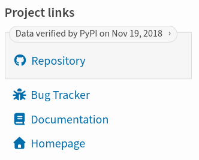
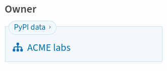
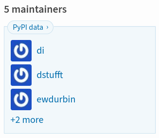
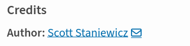
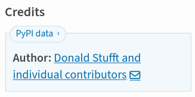
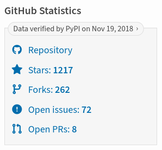

# Project Metadata

PyPI displays three types of project metadata:

* **PyPI data**: System metadata managed by PyPI
* **Verified data**: Author-provided metadata that PyPI verified at the time of upload
* **Unverified data**: Author-provided metadata that PyPI did not verify

This documentation is about **the metadata package authors can provide about a project**, and how that metadata is surfaced on PyPI. The full list of metadata is available in the [Python Packaging User Guide](https://packaging.python.org/en/latest/specifications/core-metadata/#core-metadata-specifications).

## Project name, version, and summary

The project name, release version, and a one-line summary are shown at the top of every project page.

* **Name**: The project's registered name on PyPI, from the `name` field in `pyproject.toml`. See [Choosing a Project Name](project-management/choosing-a-name.md) for naming rules and availability.
* **Version**: The version of the release being viewed, from the `version` field.
* **Summary**: A short, one-line description of the project, set via the `description` field in `pyproject.toml`. Also called the "short description" — see [Project Descriptions](project-management/project-descriptions.md) for how to write one.

<!-- TODO: add screenshot here -->

## Project links

Packages owners can specify various URLs related to their project using
the [`[project.urls]` table](https://packaging.python.org/en/latest/specifications/pyproject-toml/#urls) in the package's `pyproject.toml`.

PyPI lists all URLs together on the project page, marking those that have been verified at the time of upload. They are also available using the [JSON API](./api/json.md).

### Verified links

PyPI currently supports several ways of verifying project URLs. When a URL is verified, PyPI labels it accordingly:

<figure markdown="1">
  { loading=lazy }
  <figcaption markdown="span">A verified project link, together with unverified project links</figcaption>
</figure>

!!! warning

    Verification only attests that the PyPI package owner controlled the URL
    **at the time of upload** — it says nothing about the URL's current safety,
    ownership, or relationship to the project.

    Verification isn't repeated after upload. A URL can change hands, change
    content, or stop working entirely, and it will still display as verified.

#### Verifying links via Trusted Publishing

[Trusted Publishing](trusted-publishers/index.md) allows PyPI to attest that the
publishing workflow for a package is coming from a verified source.

The URLs that can be verified depend on the Trusted Publisher used:

- [GitHub Actions][gh-action-tab]: Packages uploaded using GHA from a repository will have the GitHub URLs for that
  repository verified. For example, for the `pypa/pip` repository, the following URLs will be verified:
    - `https://github.com/pypa/pip`
    - `https://github.com/pypa/pip/*` (all subpaths)
    - `https://github.com/pypa/pip.git`
    - `https://pypa.github.io/pip`
    - `https://pypa.github.io/pip/*` (all subpaths)
- [GitLab CI/CD][gitlab-tab]: Packages uploaded using GitLab CI/CD from a repository will have the GitLab URLs for that
  repository verified. For example, for the `pypa/pip` repository, the following URLs will be verified:
    - `https://gitlab.com/pypa/pip`
    - `https://gitlab.com/pypa/pip/*` (all subpaths)
    - `https://gitlab.com/pypa/pip.git`
- [Google Cloud][gc-tab]: No Google-specific URLs are currently verified.
- [ActiveState][active-tab]: Packages uploaded using ActiveState will have URLs linked to the project in ActiveState
  verified:
    - `https://platform.activestate.com/pypa/pip`
    - `https://platform.activestate.com/pypa/pip/*` (all subpaths)

[gh-action-tab]: trusted-publishers/creating-a-project-through-oidc.md#github-actions
[gc-tab]: trusted-publishers/creating-a-project-through-oidc.md#google-cloud
[active-tab]: trusted-publishers/creating-a-project-through-oidc.md#activestate
[gitlab-tab]: trusted-publishers/creating-a-project-through-oidc.md#gitlab-cicd

#### PyPI URLs are automatically verified

PyPI considers any URL pointing to that project on PyPI as verified.
For example, the project page for `pip` will mark all of the
following as verified:

- `https://pypi.org/project/pip/`
- `https://pypi.org/p/pip/`
- `https://pypi.python.org/project/pip`
- `https://pypi.python.org/p/pip`
- `https://python.org/pypi/pip`

### Link icons

While project links can use any label or URL, PyPI will automatically apply a custom icon if the label or domain is recognized.

Rules:

* **The table order is the priority order.** Each rule is evaluated top to bottom, and the first one that matches — whether by label or by domain — wins. For example, a GitHub link labeled "Homepage" gets the house icon, because the Homepage label rule is checked before the GitHub domain rule further down the table.
* Label matches are case-insensitive and match the whole label, except where marked `*`, which matches a prefix instead.
* Domain matches include subdomains, except where marked `†`, which match that domain exactly only.

| Name             | Icon                                       | Matches                                                                                                                 |
|:-----------------|:--------------------------------------------|:-------------------------------------------------------------------------------------------------------------------------|
| Download         | :fontawesome-solid-cloud:                  | Label: Download                                                                                                           |
| Homepage         | :fontawesome-solid-house-chimney:          | Label: Home, Homepage, Home Page                                                                                          |
| Changelog        | :fontawesome-solid-scroll:                 | Label: Changelog, Change log, Changes, News, Whatsnew, What's new, History                                                |
| Release notes    | :fontawesome-solid-newspaper:              | Label: Releasenotes, Release notes                                                                                        |
| Documentation^*^ | :fontawesome-solid-book:                   | Label: Docs^*^, Documentation^*^ Domain: [Read the Docs] domains (including `rtfd.io`/`rtfd.org`), or any URL starting with `docs.` or `documentation.` |
| Bug^*^           | :fontawesome-solid-bug:                    | Label: Bug^*^, Issue^*^, Tracker^*^, Report^*^                                                                            |
| Funding^*^       | :fontawesome-solid-circle-dollar-to-slot:  | Label: Funding^*^, Sponsor^*^, Donation^*^, Donate^*^                                                                     |
| Security         | :fontawesome-solid-shield:                 | Label: Security, Security Policy, securitypolicy                                                                          |
| GitHub           | :fontawesome-brands-github:                | Domain: `github.com`, `github.io`                                                                                        |
| GitLab           | :fontawesome-brands-gitlab:                | Domain: `gitlab.com`                                                                                                     |
| Codeberg         | :simple-codeberg:                          | Domain: `codeberg.org`, `codeberg.page`                                                                                  |
| Gitter           | :fontawesome-brands-gitter:                | Domain: `gitter.im`                                                                                                      |
| Discord^†^       | :fontawesome-brands-discord:               | Domain: `discord.com`, `discordapp.com`, `discord.gg`                                                                    |
| Telegram         | :fontawesome-brands-telegram:              | Domain: `t.me`, `telegram.me`, `telegram.dog`                                                                            |
| Matrix^†^        | :simple-matrix:                            | Domain: `matrix.to`                                                                                                      |
| Google           | :fontawesome-brands-google:                | Domain: `google.com`                                                                                                     |
| Bitbucket        | :fontawesome-brands-bitbucket:             | Domain: `bitbucket.org`                                                                                                  |
| Reddit           | :fontawesome-brands-reddit-alien:          | Domain: `reddit.com`                                                                                                     |
| Slack            | :fontawesome-brands-slack:                 | Label: Slack^*^ Domain: `slack.com`                                                                                    |
| Twitter          | :fontawesome-brands-twitter:               | Domain: `twitter.com`, `x.com`                                                                                           |
| Bluesky^†^       | :fontawesome-brands-bluesky:               | Label: Bluesky Domain: `bsky.app`                                                                                      |
| AppVeyor         | :fontawesome-solid-list-check:             | Domain: `ci.appveyor.com`                                                                                                |
| CircleCI         | :fontawesome-solid-list-check:             | Domain: `circleci.com`                                                                                                   |
| Codecov          | :fontawesome-solid-list-check:             | Domain: `codecov.io`                                                                                                     |
| Coveralls        | :fontawesome-solid-list-check:             | Domain: `coveralls.io`                                                                                                   |
| Travis CI        | :fontawesome-solid-list-check:             | Domain: `travis-ci.com`, `travis-ci.org`                                                                                 |
| PyPI^†^          | :fontawesome-solid-cube:                   | Domain: `cheeseshop.python.org`, `pypi.io`, `pypi.org`, `pypi.python.org`                                                |
| Python           | :fontawesome-brands-python:                | Domain: `python.org`, `*.python.org`                                                                                     |
| Youtube          | :fontawesome-brands-youtube:               | Domain: `youtube.com`, `youtu.be`                                                                                        |
| Mastodon         | :fontawesome-brands-mastodon:              | Label: Mastodon                                                                                                           |
| Source           | :fontawesome-solid-code-branch:            | Label: Source, Source Code, Sourcecode, Repository                                                                        |

[Read the Docs]: https://about.readthedocs.com/

## Owner, author and maintainer details

PyPI shows owner, author, and maintainer information in three separate places:

### 1. Owner

Shown only for projects owned by a [PyPI Organization](organization-accounts/index.md). This data is taken directly from the organization's PyPI account, and is **not** provided by the package maintainers via `pyproject.toml`.

Projects owned by an individual account don't show an "Owner" section — that account instead appears in [Maintainers](#2-maintainers) below.

<figure markdown="1">
  { loading=lazy }
  <figcaption markdown="span">Owner metadata in the project sidebar</figcaption>
</figure>

### 2. Maintainers

This shows every PyPI user account with a role on the project. This data is taken directly from the project's PyPI settings, and is **not** provided by the package maintainers via `pyproject.toml`. When there are more than three users associated with a project, PyPI displays the first three with a "+N more" disclosure to expand the rest.

<figure markdown="1">
  { loading=lazy }
  <figcaption markdown="span">Maintainer metadata in the project sidebar</figcaption>
</figure>

### 3. Credits

Packages can specify an author or maintainer (name, email address, or both) in their metadata, using the `authors` and `maintainers` fields in `pyproject.toml`.

By default, this is shown in the "Credits" section of the project page exactly as provided in the package's metadata:

<figure markdown="1">
  { loading=lazy }
  <figcaption markdown="span">Project credit in the project sidebar</figcaption>
</figure>

If an email address was given, PyPI also cross-references it at upload time against the public, verified email addresses of the PyPI accounts associated with the project. If PyPI finds a match, the email address is labeled as verified:

<figure markdown="1">
  { loading=lazy }
  <figcaption markdown="span">Project credit in the project sidebar</figcaption>
</figure>

As with project URLs, this cross-referencing only happens once, at the time a release file is uploaded — it does not repeat afterward.

## Repository statistics

If a release has a [verified](#verifying-links-via-trusted-publishing) GitHub or GitLab repository URL, PyPI shows a "GitHub Statistics" or "GitLab Statistics" panel with live stats for that repository — stars/forks, open issues, and open pull/merge requests.

<figure markdown="1">
  { loading=lazy }
  <figcaption markdown="span">GitHub repository statistics in the project sidebar</figcaption>
</figure>

!!! info

    Only the repository URL itself is verified by PyPI, at upload time. The
    statistics shown (stars, forks, open issues/PRs) are fetched live from
    GitHub or GitLab and are **not** independently verified by PyPI — they
    reflect whatever that repository currently reports, and can change at
    any time after the release was uploaded.

## License

PyPI displays license information in one of two forms, depending on what the release provides:

* **License expression**: If the release specifies the `license` field in `pyproject.toml` as an [SPDX license expression](https://spdx.github.io/spdx-spec/v3.0.1/annexes/spdx-license-expressions/) (`license-expression` core metadata field), that expression is shown along with a link to the [SPDX license list](https://spdx.org/licenses/).
* **License**: Otherwise, PyPI falls back to combining any `License ::` [trove classifiers](#classifiers) with the free-text legacy `license` field (truncated to its first line, or to 100 characters if that's still too long).

If a release provides neither, no License section is shown. **PyPI does not check that the stated license matches the project's actual licensing**.

## Requires Python

If a release specifies the `requires-python` field in `pyproject.toml` (the `Requires-Python` core metadata field), the supported Python version range is shown, e.g. `>=3.9`.

## Provides Extra

If a release declares [optional dependencies](https://packaging.python.org/en/latest/specifications/pyproject-toml/#dependencies-optional-dependencies) (extras) via `[project.optional-dependencies]`, the names of those extras are listed here, e.g. `pip install project[extra-name]`.

## Tags

Packages can specify free-text keywords using the `keywords` field in `pyproject.toml`. PyPI displays these as a list of tags.

## Classifiers

Packages can specify [trove classifiers](https://packaging.python.org/en/latest/specifications/core-metadata/#classifier-multiple-use) — a fixed, structured taxonomy maintained by PyPI — using the `classifiers` field in `pyproject.toml`. PyPI groups classifiers by their top-level category (e.g. `Programming Language`, `License`, `Topic`) and links each one to a search filtered on that classifier. PyPI does not check that the selected classifiers accurately describe the project.

`License ::` classifiers are also used to build the [License](#license) section when no SPDX license expression is provided.
