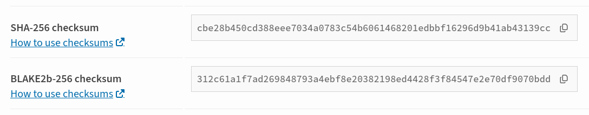

# Verifying Package Integrity

Integrity checks confirm that the file you downloaded is **bit-for-bit identical to the one the author uploaded to PyPI**. This process helps protect you from [man-in-the-middle attacks](common-attacks.md#man-in-the-middle-mitm-attacks).

## Checksums

A **checksum** is a value used to verify that a file hasn't been corrupted or tampered with; if even a single byte of the file changes, its checksum changes completely.

PyPI's checksums are generated using cryptographic **hash functions**, specifically SHA-256 and BLAKE2b. In this context, the checksum is the "hash digest" produced by running one of these algorithms over the file's contents.

For every package file hosted on PyPI, there is a corresponding checksum. You can use these to verify that the file you downloaded matches the one uploaded by the project maintainer; this is especially useful when downloading packages from a [mirror](../../about/service-availability.md#private-indices-and-mirrors).

### How to obtain and verify checksums

You can obtain these checksums from the file detail page, accessed via the "Release files" tab, or via the [JSON API](../../api/json.md).

<figure markdown="1">
  { loading=lazy }
  <figcaption>File checksums on the file detail page</figcaption>
</figure>

#### Automated verification
When installing packages with `pip`, you can use [hash checking mode](https://pip.pypa.io/en/stable/topics/secure-installs/#hash-checking-mode). In this mode, `pip` automatically verifies that the checksum of the downloaded file matches the one specified in your requirements file.

#### Manual verification
If you need to generate a checksum manually to compare against the PyPI record, you can use Python's `hashlib` library. The following example reads the file in chunks to ensure it works for files of any size:

```python
import hashlib

file_path = "file-path-to-verify"

# Initialize the hash objects
sha256_hash = hashlib.sha256()
blake2b_hash = hashlib.blake2b(digest_size=32)

with open(file_path, "rb") as f:
    # Read the file in 64 KiB chunks to handle large files efficiently
    for byte_block in iter(lambda: f.read(65536), b""):
        sha256_hash.update(byte_block)
        blake2b_hash.update(byte_block)

print(f"SHA256: {sha256_hash.hexdigest()}")
print(f"BLAKE2b-256: {blake2b_hash.hexdigest()}")
```

!!! info
    In practice, you only need to verify one of these checksums.
    
    Use SHA-256 or BLAKE2b-256 for security verification. MD5 is provided via the PyPI API for backward compatibility only, and is not recommended because of known security weaknesses.

## Limitations

A checksum only verifies that the file you have downloaded is the same as the one on PyPI's servers. It does not verify that the original code is safe or trustworthy. It also requires you to trust that the source of the checksum is secure and that the communication channel used to retrieve it (e.g., via HTTPS) has not been tampered with.
