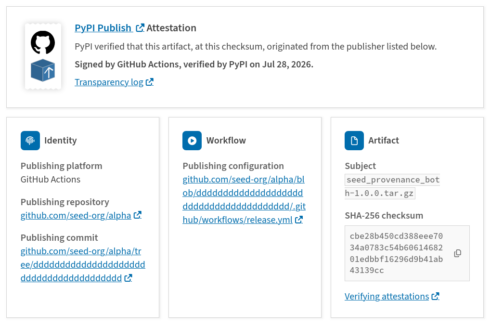
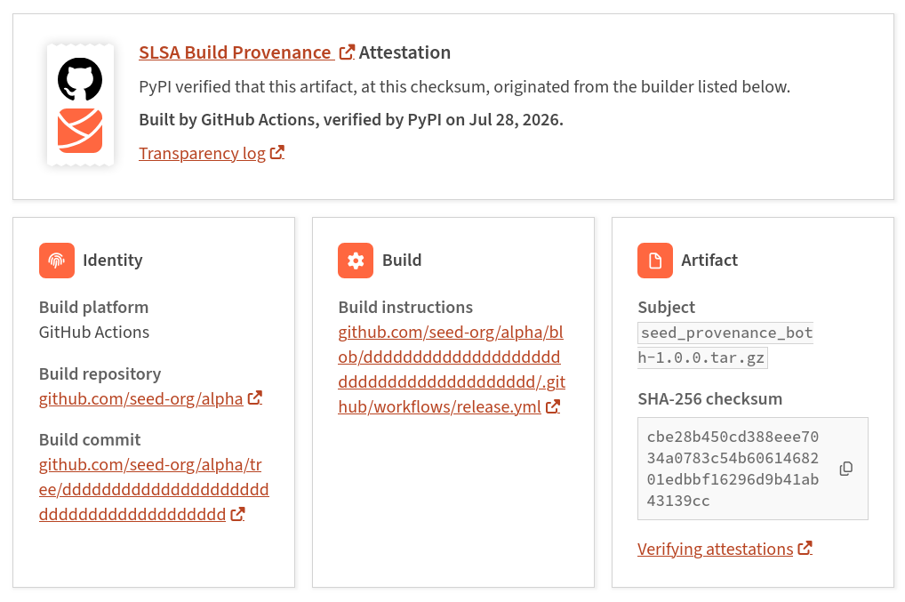

# Checking Provenance - where a package came from

## What is Provenance?

**Provenance** describes where a release file came from. On PyPI, provenance is shared via **attestations**, which provide a verifiable record of the build or publishing details.

## What is an attestation?

An [attestation](../../attestations/index.md) describes how, when, and where a package was built or published.

The presence of an attestation, and the information within it, can help protect you from [account takeover attacks](common-attacks.md#account-takeover-ato) and [supply chain attacks](common-attacks.md#supply-chain-attacks).

Attestations can be [verified](../../attestations/consuming-attestations.md), helping you decide whether a package is safe to use.

## Attestations on PyPI

If a file on PyPI has an attestation, it is displayed:

1. On the "Security" tab
2. On the file detail page

Attestations contain key details about the origin of the file, which may include:

* What source repository and source commit was used to build or publish the package
* What platform (e.g. GitHub Actions) built or published the package
* What workflow built or published the package

Each attestation is recorded in a public ledger as a [transparency log entry](https://docs.sigstore.dev/logging/overview/) ([example](https://search.sigstore.dev/?logIndex=227282797)), which is a permanent, auditable record that cannot be changed.

## Attestation types

PyPI currently supports two types of attestations:

### 1. [PyPI publish attestations](../../attestations/publish/v1.md)

An attestation, created and signed by the uploading workflow, confirming that a file was uploaded via PyPI a [Trusted Publisher](../../trusted-publishers/index.md), and that a specific Trusted Publisher identity was used to publish the file, such as a particular GitHub Actions workflow.

PyPI verifies this attestation at upload time, confirming that the identity matches what the package maintainer previously configured for Trusted Publishing.

Currently, the majority of attestations on PyPI are PyPI publish attestations. This is because producing these attestations happens by default in [the canonical workflow used by many package maintainers to publish packages](https://github.com/marketplace/actions/pypi-publish).

<figure markdown="1">
  { loading=lazy }
  <figcaption markdown="span">A [PyPI publish attestation](../../attestations/publish/v1.md) on PyPI</figcaption>
</figure>

### 2. [SLSA attestations](https://slsa.dev/provenance/v1)

An attestation and associated transparency log, signed by the build platform (e.g., GitHub, Google Cloud), that details exactly how the file was produced, cryptographically linking the final artifact back to its original source code (if available), build instructions or build log.

<figure markdown="1">
  { loading=lazy }
  <figcaption markdown="span">A [SLSA attestation](https://slsa.dev/provenance/v1) on PyPI</figcaption>
</figure>

## Verifying attestations

Verification isn't yet built into common package installers, but third-party tools exist today — for example, [pip-plugin-pep740](https://github.com/trailofbits/pip-plugin-pep740) verifies attestations before allowing an install to proceed. Native support has been proposed for both [pip](https://github.com/pypa/pip/issues/12766) and [uv](https://github.com/astral-sh/uv/issues/9122), but neither is actively in development yet.

In the meantime, users can manually consume and verify attestations for a project by retrieving them from PyPI's [Integrity API](../../api/integrity.md). See our [documentation on consuming attestations](../../attestations/consuming-attestations.md) for additional information.

## Provenance/attestation warnings

PyPI displays warnings when the provenance metadata for a release is missing, incomplete, or conflicts with the history of the project. These warnings are designed to help you identify potential [supply chain attacks](common-attacks.md#supply-chain-attacks).

### Incomplete provenance
*   **What it means:** A portion of the files in this release were uploaded without an attestation.
*   **Why it matters:** While this can happen due to build or publishing configuration errors (such as mixing manual uploads with automated CI workflows), it can also indicate that some of the files have been uploaded by a malicious actor.

### Inconsistent provenance
*   **What it means:** The attestation metadata indicates that the release files were produced by different, unrelated build or publishing pipelines, or originated from different source repositories.
*   **Why it matters:** A project's release should ideally originate from a single, consistent, and trusted build or publishing process. If files within the same release exhibit different provenances, it can suggest that some or all of the files come from a malicious source.

### Change of provenance
*   **What it means:** The build or publishing pipeline or source identity that made the release files differ from a previous release.
*   **Why it matters:** While this is often the result of a legitimate infrastructure migration (e.g., moving a project to a new GitHub organization or switching to a different CI platform), it can also be a signal of a supply chain attack or account takeover. If you notice this warning on a package you depend on, verify the change via the project's official communication channels or release notes to ensure it was an intentional transition by the maintainers.

### Loss of provenance
*   **What it means:** The maintainers previously used secure, verifiable build or publishing methods (such as [Trusted Publishing](../../trusted-publishers/index.md)), but have reverted to a manual or unverified process.
*   **Why it matters:** While this may simply reflect a conscious choice by the maintainers to change their publishing workflow, it can also signal an account takeover where an attacker has bypassed secure publishing requirements. If a project was previously "provenanced," this sudden drop in transparency warrants caution; consider checking the project's security policy or recent announcements to confirm the change was intentional.

## Attestation limitations

Attestations are a big step forward for securing the Python packaging ecosystem, but they do have limitations:

* **Code Safety**: An attestation only tells you where a file came from. It does not mean the original code or the build environment is safe or trustworthy.

* **Implicit Trust**: When you trust an attestation, you are implicitly trusting the processes and authority of the organization that issued it. 

See the [attestations security model documentation](../../attestations/security-model.md) for a more detailed look into what attestations actually assert, and the trust assumptions behind them.
